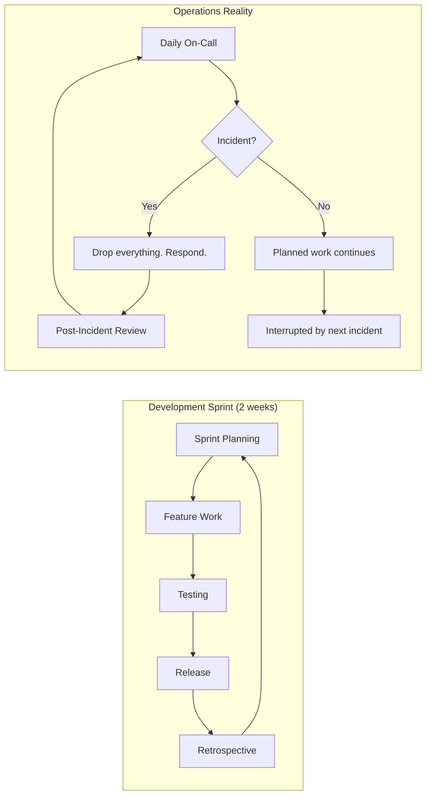

## 🎯 Learning Objectives

By the end of this chapter, you will understand:

- The fundamental differences between development and operations work
- Why traditional agile methodologies create friction for operations teams
- The specific challenges that system administrators face with sprint-based approaches
- Real-world scenarios where agile falls short in operations contexts

> **A quick word on who this is for.** If your "team" is really a band of specialists each running their own projects, systems, and pagers — doing a heavy mix of operational work and R&D with only a sprinkle of development — and you've been quietly suspecting that Scrum was built for somebody else's job, this chapter is going to feel uncomfortably familiar. That discomfort is the point. Keep reading.

## 🚨 The Reality of Operations Work

Imagine this scenario: It's Tuesday morning, you're in the middle of sprint planning for the next two weeks. Your team has carefully estimated story points, committed to deliverables, and blocked out time for focused development work. Suddenly, your monitoring system starts screaming - the main database server is showing signs of imminent failure, customer-facing services are experiencing intermittent timeouts, and the CEO is asking for updates every 15 minutes.

**What do you do?**

In development, you might defer this to the next sprint or create an emergency user story. In operations, you drop everything and fix it. **Right now.**

This fundamental difference in work patterns is why traditional agile methodologies, while revolutionary for software development, often create more problems than they solve for system administrators and operations teams.

## 📊 The Research Behind the Problem

There is no single peer-reviewed study that isolates "traditional agile applied to operations" and assigns it a precise burnout or productivity figure. What the industry research _does_ establish is the underlying mechanism this chapter is concerned with: operational toil drives burnout and attrition, and team culture — not ceremony adherence — drives performance.

**Operational toil is a documented driver of burnout.** Google's Site Reliability Engineering practice defines _toil_ as work tied to running a service that is manual, repetitive, automatable, tactical, and devoid of enduring value. Google explicitly caps toil at **50% of an SRE's time** precisely because, in their words, "too much toil leads to burnout, boredom, and discontent," as well as career stagnation and attrition ([Google SRE Book, "Eliminating Toil"](https://sre.google/sre-book/eliminating-toil/)). Critically, toil is characterised as _interrupt-driven and reactive_ — the exact mode of work that sprint commitments assume will not happen.

**Culture and work distribution measurably affect well-being and performance.** The 2023 DORA _Accelerate State of DevOps Report_ found that generative (high-trust, information-sharing) organisational cultures correlate with **30% higher organisational performance**, and that equitable distribution of work — particularly of repetitive tasks — reduces burnout ([DORA 2023 Report](https://dora.dev/research/2023/dora-report/)). A process that repeatedly forces unplanned operational work to "disrupt" planned commitments concentrates exactly this kind of repetitive, low-credit work.

**Why this matters for the argument:** The friction operations teams feel under sprint-based agile is not anecdotal grumbling — it maps directly onto well-documented burnout drivers (uncapped reactive toil) and performance drivers (culture and fair work distribution). The rest of this chapter examines _why_ the mismatch occurs; the research above establishes _that_ the cost is real.

### 🔴 Problem Statement

Operations teams working under sprint-based agile methodologies face a structural contradiction that no amount of process tuning can fix:

> **The problem**: Sprint cadences assume work is predictable, interruptible at iteration boundaries, and measurable by feature velocity. Operations work is none of those things. It is reactive, continuous, and measured by availability and reliability. Forcing operations into sprint-shaped boxes creates more friction than structure — teams spend more energy explaining why they missed commitments than actually doing the work that keeps services running.

The observable symptoms are consistent across team sizes and industries:

- **Chronic sprint disruption**: unplanned incidents routinely exceed the buffer that sprint planning allows, turning every iteration into a story of broken commitments
- **Improvement starvation**: proactive work (automation, documentation, refactoring) is systematically deferred because reactive work consumes all available capacity
- **Metric distortion**: teams are measured by velocity and story points that cannot represent the value of keeping a service stable or preventing an outage
- **Cultural damage**: operations work is implicitly framed as a "disruption to velocity," creating a narrative where doing the team's actual job is treated as a failure

This is not a people problem. It is a methodology problem. The work is not wrong — the container is.

### The Root Causes

**Interrupt-Driven Work Environment**: Operations teams must respond to incidents, outages, and urgent requests that cannot wait for the next sprint planning session. Emergency fixes and critical system failures require immediate attention, breaking the predictable rhythm that agile methodologies depend on.

**Mixed Work Types**: Unlike development teams focused on feature delivery, operations teams handle both planned project work and unplanned reactive tasks. This duality creates scheduling conflicts and resource allocation challenges that traditional agile frameworks struggle to accommodate.

**24/7 Service Requirements**: System availability expectations mean operations teams cannot defer critical issues to align with sprint boundaries. The need for continuous availability creates pressure that conflicts with the structured time-boxing of agile sprints.

**Complex Dependencies**: Infrastructure changes often have cascading effects across multiple systems and services. The interconnected nature of operational work requires more flexible planning and execution models than traditional agile provides.

## 🎭 Real-World Scenarios: When Agile Goes Wrong

### Scenario 1: The Sprint-Breaking Incident

**The Setup**: A 5-person infrastructure team has committed to migrating 20 services to new hardware during a 2-week sprint. They've estimated story points, created tasks, and everyone knows their role.

**The Crisis**: Day 3 of the sprint - a major security vulnerability is discovered in the core authentication service. Immediate patching required across 150 servers.

**The Agile Response**: "Let's create an emergency user story and adjust sprint commitments."

**The Reality**: By the time the team finishes the emergency response, sprint planning, and re-estimation, they've lost 3 days. The migration work suffers, technical debt increases, and team morale drops.

### Scenario 2: The Estimation Nightmare

**The Problem**: How do you estimate story points for "maintain 99.9% uptime"? Operations work doesn't fit neatly into development estimation models.

**The Agile Solution**: Break it down into smaller tasks.

**The Reality**: You can't break down unpredictable work. How many story points is a network outage? What's the velocity of disaster recovery?

### Scenario 3: The Retrospective That Never Ends

**The Question**: "What went wrong this sprint?"

**The Answers**:

- "Production outage on Tuesday"
- "Emergency security patch on Thursday"
- "Database corruption on Saturday"
- "Network issues on Sunday"

**The Pattern**: Every retrospective focuses on unplanned work that "disrupted" the sprint, creating a culture where normal operations work is seen as failure.

### Scenario 4: The Two-Person Team

**The Setup**: A two-person IT team supporting a 50-person company. They manage everything — laptops, servers, network, SaaS integrations, vendor relations, and the occasional CEO printer emergency. They have no dedicated on-call rotation because they _are_ the rotation.

**The Sprint**: They commit to "migrate the file server to the cloud" and "document the network topology" during a two-week sprint.

**The Interruptions**:

- Day 2: A critical vendor API deprecation breaks the CRM integration (3 days of firefighting, vendor calls, and a temporary workaround)
- Day 5: The CFO's laptop dies (2 hours sourcing a replacement, half a day migrating data)
- Day 8: A phishing campaign hits three users (incident response, password resets, security scan — two full days)
- Day 11: The file server migration, now compressed into two days, rushed and poorly tested

**The Reality**: Small teams cannot absorb interruptions the way larger teams can. A single incident consumes 50% of the team's capacity for that day. Sprint-based planning does not account for this fragility.

### Scenario 5: The Regulated Environment

**The Setup**: A platform team manages the infrastructure for a fintech application handling payment card data. Every change must pass compliance review, and audit trails are mandatory for all configuration changes.

**The Sprint**: They plan to deploy a database encryption upgrade across three environments during a month-long iteration.

**The Reality**:

- The change requires sign-off from security, compliance, and the DPO — a process that takes 3-5 business days regardless of urgency
- A critical vulnerability (CVSS 9.0) is disclosed on day 4. The team must patch within 72 hours per PCI DSS requirements, but the emergency change process still requires documentation, testing in a staging environment, and post-change verification
- The "sprint" becomes an exercise in managing paperwork alongside the technical response. The encryption upgrade is delayed by two weeks because compliance review cycles do not align with sprint boundaries

**The Pattern**: Regulated environments add a compliance layer that operates on its own calendar. Sprint-based planning fails when external gatekeepers control the release cadence.

## 🧩 The Fundamental Mismatch

### Development Work Characteristics:

- **Predictable scope** - Features can be defined and estimated
- **Controlled timeline** - Work happens when developers choose
- **Quality gates** - Testing can happen in dedicated phases
- **Bounded complexity** - Code changes are typically isolated
- **Planned releases** - Deployment timing is flexible

### Operations Work Characteristics:

- **Unpredictable scope** - Incidents vary wildly in complexity
- **Reactive timeline** - Work happens when systems demand it
- **Continuous quality** - Monitoring and maintenance never stop
- **Systemic complexity** - Changes affect multiple interconnected systems
- **Continuous delivery** - Systems must always be available

The visual difference between planned and interrupt-driven work tells the story more clearly than any table:

> **Diagram**: Comparison of development sprint flow (plan → build → test → release → retro) vs operations reality (on-call → incidents → interrupts → firefighting)

## 💡 The "Agile Fallacy" in Operations

The agile manifesto states: "Responding to change over following a plan." This sounds perfect for operations teams, right? Wrong.

The fallacy lies in assuming that "responding to change" means the same thing for developers and operators:

- **For developers**: Responding to changing requirements, new feature requests, or market feedback
- **For operators**: Responding to system failures, security threats, and service degradation

Development changes are typically **planned disruptions** to the workflow. Operations changes are **unplanned disruptions** that cannot be deferred or scheduled.

## 🎮 Interactive Challenge: Sprint vs. Reality

**Try This Exercise**: Plan a perfect 2-week operations sprint for your team. Include:

- Planned maintenance windows
- Infrastructure improvements
- Documentation updates
- Tool automation projects

Now simulate these realistic interruptions:

- Day 2: Database performance issue (4-hour investigation)
- Day 5: Security patch deployment (8-hour rollout)
- Day 8: Network equipment failure (12-hour replacement)
- Day 10: Application outage investigation (6 hours)
- Day 12: Compliance audit support (full day)

**Question**: How much of your planned sprint work actually got completed?

**Reality Check**: If this exercise frustrated you, imagine living it every two weeks for a year.

## 🔍 The Hidden Costs of Agile Mismatch

When operations teams try to force-fit into agile methodologies, several hidden costs emerge:

### Psychological Costs

- **Chronic stress** from constant sprint disruptions
- **Impostor syndrome** when teams can't meet development-style commitments
- **Burnout** from trying to maintain both reactive availability and proactive planning

### Operational Costs

- **Technical debt accumulation** as planned improvements get repeatedly deferred
- **Decreased system reliability** as focus shifts to sprint commitments over service quality
- **Knowledge silos** as team members specialize to meet sprint velocity requirements

### Organizational Costs

- **Misaligned metrics** that don't reflect operational value
- **Resource conflicts** between planned work and operational needs
- **Cultural friction** between development and operations teams

## 🌟 Key Insights: What Operations Teams Actually Need

Through analysis of successful operations teams, several key needs emerge that traditional agile doesn't address:

1. **Flexible time allocation** between planned and unplanned work
2. **Service-focused metrics** rather than feature-delivery metrics
3. **Continuous improvement cycles** that don't conflict with operational responsibilities
4. **Risk-aware planning** that accounts for operational uncertainties
5. **Knowledge-sharing processes** that build team resilience
6. **Automation-first approaches** that reduce toil and increase reliability

### 📐 Design Requirements for a Better Ops Methodology

If traditional agile is the wrong container, what would the right one look like? From the pain points, scenarios, and key insights above, we can derive a set of requirements that any operations methodology must satisfy:

| #   | Requirement                                                                                                       | Why                                                                                                      | Rules out                                                                   |
| --- | ----------------------------------------------------------------------------------------------------------------- | -------------------------------------------------------------------------------------------------------- | --------------------------------------------------------------------------- |
| 1   | **Multi-horizon planning** — separate cadences for reactive, improvement, and strategic work                      | Operations has work at three different time horizons, each with a different planning approach            | Single-cadence frameworks (Scrum, SAFe)                                     |
| 2   | **Built-in interrupt capacity** — unplanned work is expected, not exceptional                                     | Interruptions are a feature of operations, not a defect to be managed out                                | Any methodology with fixed sprint commitments                               |
| 3   | **Service-focused metrics** — measure availability, reliability, and toil, not velocity                           | The value of operations is in keeping services running, not shipping features                            | Velocity-based measurement systems                                          |
| 4   | **Sustainable improvement cycle** — protected time for proactive work that does not compete with reactive demands | Without structural protection, improvement work dies first                                               | Teams that allocate "some percentage of time" without structural separation |
| 5   | **Principle-driven decisions** — a values framework for choices the runbook does not cover                        | Operations veterans make judgement calls under pressure daily; they need principles, not more procedures | Purely procedural frameworks                                                |
| 6   | **Progressive adoption** — teams can start with one cycle and expand, not a big-bang transformation               | Most operations teams lack the slack for a full framework rollout                                        | All-or-nothing methodologies                                                |

**What this means for the rest of the book:** Chapter 2 (Core Principles) satisfies requirement 5. Chapter 3 (Framework Structure) satisfies requirements 1, 2, and 4. Chapters 6 and 7 satisfy requirement 3. Chapter 5 describes the progressive adoption that requirement 6 demands.

## 📝 Chapter Summary

The fundamental challenge is not that operations teams are "doing agile wrong" - it's that traditional agile methodologies were designed for a different type of work. The sprint-based, commitment-driven, velocity-focused approach of Scrum and similar frameworks creates artificial constraints that conflict with the interrupt-driven, service-focused, availability-first nature of operations work.

Understanding this mismatch is the first step toward finding better approaches. The solution isn't to abandon structure and continuous improvement - it's to develop methodologies specifically designed for the unique challenges and requirements of system administration and operations teams.

## 🎯 Next Steps

In the next chapter, we'll explore the core principles and values that form the foundation of the SysOps Framework - a methodology designed specifically to address the challenges identified in this chapter while maintaining the benefits of structured, continuously improving workflows.

## 💭 Reflection Questions

1. **Recognition**: Which of the scenarios described match your team's experiences?
2. **Impact Assessment**: How has agile methodology mismatch affected your team's effectiveness?
3. **Opportunity Identification**: What would success look like if your team had a methodology designed for operations work?

---

**🎮 Gamification Element - Chapter 1 Badge**
_Complete the "Sprint vs. Reality" exercise and identify 3 specific ways traditional agile has impacted your operations team to earn the "Challenge Identifier" badge._

**📚 Additional Resources**

- [Google SRE Book — "Eliminating Toil"](https://sre.google/sre-book/eliminating-toil/): the definition of toil, the 50% cap, and its link to burnout and attrition
- [DORA 2023 Accelerate State of DevOps Report](https://dora.dev/research/2023/dora-report/): the role of culture and equitable work distribution in performance and well-being
- [Google SRE Book — Table of Contents](https://sre.google/sre-book/table-of-contents/): the broader operations-specific practice this framework draws on

---

_[← Previous: Introduction](../README.md) | [Next: Chapter 2 - Core Principles →](chapter-02-principles.md)_
