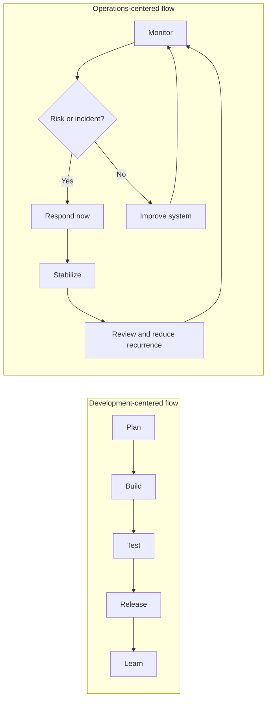

## 🎯 Learning Objectives

By the end of this chapter, you will understand:

- Why operations work often breaks sprint-based planning even when the team is disciplined
- Why the problem is structural, not personal
- Which symptoms show that your team needs an operations-specific operating model
- What design requirements any serious operations methodology must satisfy

## 🔴 The Problem in One Page

Most operations teams are not failing Scrum because they are careless, undisciplined, or resistant to improvement.

They are struggling because the work itself does not respect sprint boundaries.

Incidents, pages, urgent patches, compliance requests, failed backups, capacity alerts, vendor escalations, access issues, and customer-impacting outages arrive when they arrive. They do not wait for sprint planning. They do not care about story points. They do not fit neatly into a two-week commitment.

That is the central challenge this book addresses.

> **The problem:** sprint-based planning assumes that work can be shaped into a stable commitment window. Operations work is reactive, continuous, and service-bound. When teams force operations into sprint-shaped containers, the result is often not agility - it is commitment theatre.

The common symptoms are easy to recognize:

- **Every sprint is “interrupted” by normal operational work**
- **Planned improvement work is constantly postponed**
- **The team spends more time explaining missed commitments than improving reliability**
- **Velocity becomes a poor proxy for value**
- **Operations work starts to feel like a disruption instead of the team's actual mission**
- **The same incidents, manual tasks, and knowledge gaps return month after month**

This is not a people problem. It is a work-shape problem.

The work is not wrong. The container is.

## 👥 Who This Chapter Is For

This chapter is for teams that live in a mixed operational reality:

- system administrators maintaining infrastructure and user-facing services
- platform teams balancing reliability, delivery enablement, and internal support
- small IT teams responsible for everything from laptops to production systems
- DevOps or SRE-adjacent teams with real on-call and interrupt load
- infrastructure teams that do project work, support work, security work, and emergency work at the same time

It is especially relevant if your team has tried to use Scrum, sprint planning, or feature-style estimation and repeatedly ended up with the same conclusion:

> “The process looks reasonable on paper, but it does not match how our work actually happens.”

This chapter is **not** saying that Scrum, Kanban, ITIL, SRE, or DevOps are wrong. They solve real problems in the right context. The claim is narrower:

> Operations teams with high interrupt load need an operating model that treats reactive work as a first-class reality, not as a recurring planning failure.

## 🚨 The Reality of Operations Work

Imagine a familiar Tuesday morning.

Your team is in the middle of planning the next two weeks. There is a backlog, a set of estimates, a few infrastructure improvements, some documentation tasks, and a migration that has already been postponed twice.

Then monitoring starts to scream.

The main database is showing signs of imminent failure. Customer-facing services are timing out. A senior manager wants updates every fifteen minutes. Security asks whether the affected system contains sensitive data. Someone notices that the last failover test was six months ago.

What do you do?

You stop planning and respond.

Not because you failed the sprint. Not because you lack discipline. Not because the team is bad at estimating.

You respond because that is the job.

Operations teams are accountable for continuity. When the service is at risk, the plan changes immediately. The work is driven by systems, users, dependencies, vulnerabilities, and time-sensitive obligations - not only by backlog priority.

That is the fundamental difference between development-centered planning and operations-centered work.

## 📊 What Existing Research Tells Us

There is no single universal study that proves “Scrum causes burnout in operations teams.” The real world is more complex than that.

But industry research and SRE practice do establish the mechanism behind the problem:

1. **Reactive toil burns teams down when it is not controlled**
2. **Repetitive operational work must be made visible and reduced**
3. **High-trust culture and fair work distribution improve performance**
4. **Reliability work needs different metrics than feature delivery**

Google’s Site Reliability Engineering practice defines toil as manual, repetitive, automatable, tactical work that does not create lasting value. Google explicitly warns that excessive toil leads to burnout, boredom, discontent, career stagnation, and attrition. Their well-known guidance that SREs should spend at least half their time on engineering work exists because reactive operational work expands unless it is deliberately constrained.

DORA research reaches a compatible conclusion from another angle: team culture, work distribution, and continuous improvement matter. Teams perform better when work is visible, learning is shared, and repetitive burdens are not silently pushed onto the same people.

The implication for operations teams is simple:

> If a methodology makes reactive work invisible, treats incidents as sprint disruption, and rewards only planned delivery, it will distort both behaviour and morale.

SysOps starts from a different assumption: operations work includes interruptions by design. The methodology must create structure around that reality instead of pretending it can be planned away.

## 🧩 The Fundamental Mismatch

Development and operations are both technical disciplines, but their work patterns are not the same.

### Development-centered work usually has these properties

- **Scope can often be shaped before execution**
- **Work can be decomposed into features, stories, and tasks**
- **Delivery can usually be negotiated within a release window**
- **Progress is visible through shipped change**
- **Planning assumes a mostly protected execution period**

### Operations-centered work usually has these properties

- **Scope changes when systems fail or risk changes**
- **Work combines planned, reactive, preventive, and support tasks**
- **Urgency is often imposed externally**
- **Value is often invisible when everything works**
- **Planning must reserve capacity for unknown events**

A development team may ask:

> “What can we deliver in this sprint?”

An operations team must also ask:

> “What must remain stable while we are trying to improve it?”

That second question changes everything.

**Takeaway:** development flow is primarily delivery-shaped; operations flow is stability-shaped. A good operations methodology must support both improvement and interruption.

## 🎭 Five Common Failure Patterns

The following scenarios are not edge cases. They are recurring patterns that appear when operations teams are measured and managed as if they were feature teams.

### Pattern 1: The Sprint-Breaking Incident

A five-person infrastructure team commits to a two-week migration. The plan is realistic. The estimates are reasonable. Everyone understands the work.

On day three, a critical authentication vulnerability is disclosed. The team must patch 150 servers, validate service health, communicate risk, and prepare a post-change report.

The sprint is now broken.

The usual response is to create an emergency story, adjust the sprint, and explain the variance later. But this does not solve the real issue. The incident was not a process exception; it was part of the operational reality the process failed to model.

**What this reveals:** if incidents are normal, the operating model must reserve interrupt capacity by design.

### Pattern 2: The Estimation Trap

A manager asks the team to estimate “maintain 99.9% uptime” or “handle production support.”

The team tries to break this into tasks. Some of them can be estimated: patching, certificate renewal, backup testing, monitoring cleanup. But the most important part cannot be predicted: the outage that has not happened yet.

How many story points is a network failure?

What is the velocity of disaster recovery?

How do you estimate the work that successful operations prevents from happening?

**What this reveals:** operations value cannot be represented only through task completion. It also lives in availability, reliability, reduced toil, lower risk, and faster recovery.

### Pattern 3: The Retrospective Loop

Every retrospective ends the same way:

- “The outage disrupted the sprint.”
- “The security patch took longer than expected.”
- “The vendor escalation blocked us.”
- “The planned improvement work slipped again.”

The team identifies the pattern, but the next sprint repeats it. The process produces awareness without structural change.

Over time, the language becomes damaging. Operational work is described as “noise,” “interruptions,” or “unplanned disruption,” even when it is the exact work the team exists to perform.

**What this reveals:** a methodology that treats normal operations as repeated exception will eventually damage culture.

### Pattern 4: The Two-Person Team

A two-person IT team supports a fifty-person company. They manage laptops, servers, identity, network, backups, SaaS integrations, vendor tickets, and security incidents. They also own internal improvement projects because there is nobody else.

They plan a two-week sprint:

- migrate the file server to cloud storage
- document the network topology
- clean up stale user accounts

Then reality arrives:

- a vendor API change breaks a business workflow
- a laptop failure blocks finance work
- a phishing campaign hits several users
- a backup warning needs investigation
- the CEO needs urgent help before a customer meeting

Nothing here is unusual. But for a two-person team, one serious interruption can consume half of the team’s daily capacity.

**What this reveals:** small teams need lighter, more resilient planning than large delivery frameworks assume.

### Pattern 5: The Regulated Environment

A platform team manages infrastructure for a regulated application. Every production change requires evidence, approval, testing, rollback planning, and auditability.

The team plans a database encryption upgrade. Then a high-severity vulnerability appears. The emergency patch must happen quickly, but the team still needs documentation, risk assessment, validation, and post-change review.

The sprint plan gives the illusion of control. The real schedule is shaped by compliance gates, security deadlines, business risk, and service availability.

**What this reveals:** regulated operations need a methodology that integrates risk and evidence into daily work instead of treating compliance as external paperwork.

## 💡 The Agile Fallacy in Operations

The Agile Manifesto values “responding to change over following a plan.”

At first glance, that sounds perfect for operations.

The problem is that “change” means different things in different work systems.

For product development, change often means evolving requirements, market feedback, or a better understanding of user needs. The team adapts while still pursuing a product goal.

For operations, change often means service degradation, data risk, security exposure, hardware failure, certificate expiry, audit demand, or production instability. The team adapts because the system requires immediate attention.

These are not the same kind of change.

A sprint can absorb some uncertainty. But when interrupt load is structural, recurring, and urgent, the sprint stops being a planning tool and becomes a reporting ritual for why reality did not match the plan.

The fallacy is not “agile is bad.”

The fallacy is assuming that the same cadence can govern feature delivery, operational response, reliability improvement, compliance evidence, user support, and strategic infrastructure evolution at the same time.

## 🎮 Exercise: Sprint vs. Reality

Try this exercise with your team.

Plan a perfect two-week operations sprint. Include:

- planned maintenance
- infrastructure improvements
- documentation
- automation
- security cleanup
- monitoring improvements

Now add a realistic interrupt stream:

| Day | Event                            | Capacity impact                  |
| --- | -------------------------------- | -------------------------------- |
| 2   | Database performance issue       | 4-hour investigation             |
| 5   | Security patch rollout           | 8 hours plus validation          |
| 8   | Network equipment failure        | 12-hour response and replacement |
| 10  | Application outage investigation | 6 hours plus communication       |
| 12  | Compliance audit support         | 1 full day                       |

Now ask three questions:

1. How much planned work survived?
2. Which work was postponed first?
3. Did the process help you make better trade-offs, or did it only record the failure?

If this exercise feels frustrating, that is useful data. It means the problem is visible enough to redesign the operating model.

## 🔍 The Hidden Costs of the Mismatch

The cost of the mismatch is not only missed sprint commitments.

It accumulates across people, systems, and organizational trust.

### Psychological costs

- Teams feel like they are constantly failing at a process that was never designed around their reality
- Engineers become tired of explaining why urgent operational work displaced planned work
- Burnout increases when reactive work is unlimited and improvement work is never protected
- People stop believing planning matters because plans rarely survive contact with operations

### Operational costs

- Automation is delayed because manual work consumes the available capacity
- Documentation decays because urgent work always wins
- Post-incident actions are identified but not completed
- Reliability work becomes invisible until the next outage
- Knowledge remains concentrated in a few overloaded people

### Organizational costs

- Leadership sees missed commitments but not the interrupt load behind them
- Development and operations teams develop conflicting definitions of progress
- Metrics reward visible delivery over avoided failure
- Risk accumulates quietly because preventive work has no protected cadence

A poor methodology does not merely fail to help. It teaches the organization to misunderstand the work.

## 🌟 What Operations Teams Actually Need

Operations teams do not need less structure. They need structure that matches the shape of their work.

A useful operations methodology must provide:

1. **A daily mechanism for reactive work**
   Incidents, service requests, urgent risk, and operational health need immediate visibility and triage.

2. **A weekly mechanism for improvement work**
   Automation, documentation, post-incident actions, reliability fixes, and toil reduction need protected space.

3. **A monthly mechanism for strategic direction**
   Capacity, architecture, lifecycle, major risks, vendor decisions, and platform evolution need a longer horizon.

4. **Service-focused metrics**
   Availability, reliability, recovery, toil, change failure, support load, and risk reduction matter more than velocity.

5. **Explicit interrupt capacity**
   Unplanned work must be expected, measured, and managed - not hidden inside failed sprint commitments.

6. **Risk-aware decision-making**
   Operations teams constantly trade speed, reliability, cost, security, compliance, and human sustainability.

7. **Progressive adoption**
   Most teams cannot adopt a full methodology in one big transformation. They need a path that starts small and becomes stronger over time.

## 📐 Design Requirements for a Better Methodology

The rest of this book builds from the following requirements.

| #   | Requirement                     | Why it matters                                                    | What it prevents                            |
| --- | ------------------------------- | ----------------------------------------------------------------- | ------------------------------------------- |
| 1   | **Multi-horizon planning**      | Operations work exists at daily, weekly, and monthly horizons     | Forcing all work into one cadence           |
| 2   | **Built-in interrupt capacity** | Unplanned work is normal in operations                            | Treating every incident as planning failure |
| 3   | **Service-focused metrics**     | Operations value is stability, reliability, and risk reduction    | Measuring ops only by velocity              |
| 4   | **Protected improvement cycle** | Preventive work disappears unless deliberately protected          | Endless firefighting                        |
| 5   | **Principle-driven decisions**  | Not every operational choice can be covered by a runbook          | Blind process compliance                    |
| 6   | **Progressive adoption**        | Teams under pressure cannot survive big-bang transformation       | Framework overload                          |
| 7   | **Evidence and learning loops** | Incidents, changes, and compliance all require traceable learning | Repeated failures and audit panic           |

These requirements map directly to the structure of SysOps Framework:

- **Chapter 2** defines the principles behind operational decisions
- **Chapter 3** introduces the daily, weekly, and monthly cycles
- **Chapter 5** explains progressive implementation
- **Chapter 6** turns the model into concrete practices
- **Chapter 7** defines metrics that reflect operational value
- **Chapter 10** connects the framework to risk and compliance

## 📝 Chapter Summary

Operations teams are not “bad at agile” simply because their sprint plans keep changing. Many are trying to use a planning model that assumes more predictability than their work can provide.

The core challenge is structural:

> Operations work is continuous, interrupt-driven, risk-sensitive, and service-focused. A methodology for operations must be built around that reality.

This chapter established the mismatch. The next chapter defines the principles that SysOps uses to resolve it.

## 🎯 Next Steps

In the next chapter, we will define the core principles of SysOps Framework: the decision rules that help operations teams choose the right action when reliability, speed, risk, cost, and human sustainability compete.

## 💭 Reflection Questions

1. Which failure pattern in this chapter best matches your team?
2. Which type of work is most often sacrificed when interruptions arrive?
3. What does your organization currently measure: delivery activity, operational value, or both?
4. What would change if interrupt capacity was visible and planned instead of treated as failure?

---

**🎮 Gamification Element - Chapter 1 Badge**

Complete the “Sprint vs. Reality” exercise and identify three ways your current planning method hides or distorts operational work to earn the **Challenge Identifier** badge.

**📚 Additional Resources**

- [Google SRE Book - “Eliminating Toil”](https://sre.google/sre-book/eliminating-toil/)
- [DORA Accelerate State of DevOps Research](https://dora.dev/research/)
- [Google SRE Book - Table of Contents](https://sre.google/sre-book/table-of-contents/)

---

_[← Previous: Introduction](../README.md) | [Next: Chapter 2 - Core Principles →](chapter-02-principles.md)_
