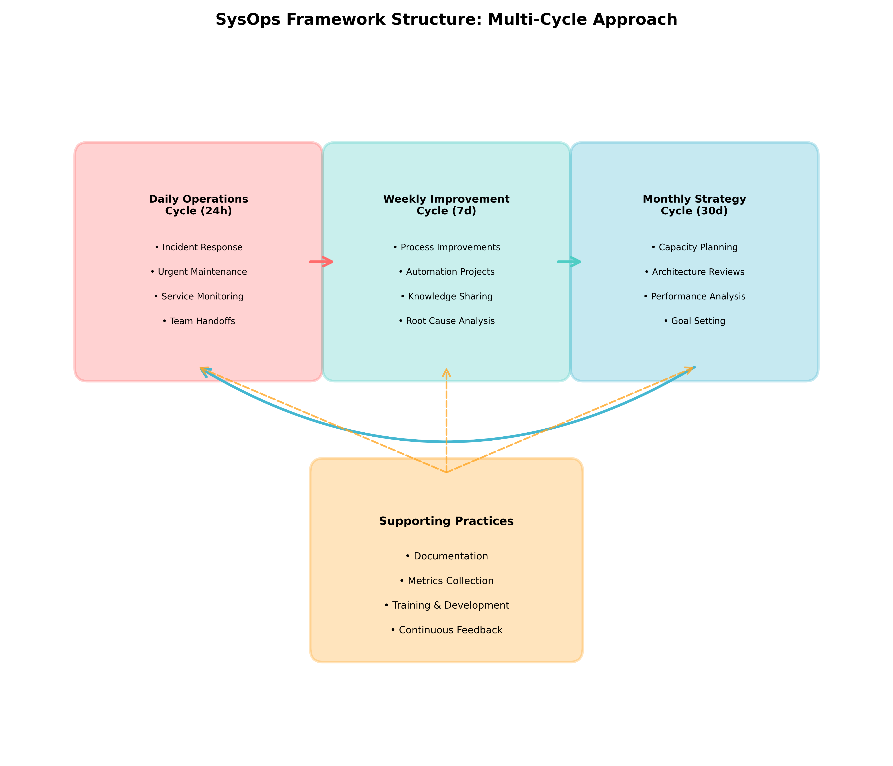

> _"Operations teams don't need sprints; they need cycles that match the rhythm of their work."_

## 🎯 Learning Objectives

By the end of this chapter, you will understand:

- The three operational cycles that replace traditional sprints
- How multiple cycles run simultaneously without conflict
- The specific activities and outcomes of each cycle
- How to adapt the cycles to your team's needs

## 🔄 The Multi-Cycle Approach

Traditional agile frameworks use a single cycle (sprint) to organize all work. This creates artificial constraints for operations teams who handle different types of work with different time horizons and urgency levels. The SysOps Framework uses three interconnected cycles that run simultaneously:

1. **Daily Operations Cycle** (24-48 hours): Immediate operational needs
2. **Weekly Improvement Cycle** (7 days): Process improvements and systematic issues
3. **Monthly Strategy Cycle** (4 weeks): Strategic initiatives and major projects

This multi-cycle approach acknowledges that operations teams simultaneously:

- Respond to immediate issues (daily)
- Improve systems and processes (weekly)
- Plan and execute strategic changes (monthly)

## ⚡ Daily Operations Cycle (24-48 hours)

### Purpose

Handle immediate operational needs: system monitoring, incident response, routine maintenance, and urgent requests that cannot be deferred.

### The Cycle Flow: Monitor → Respond → Document → Review

#### 1. Monitor (Ongoing)

**Activities**:

- Continuous system monitoring and alerting
- Daily health checks and status reviews
- Early warning identification
- Trend analysis and pattern recognition

**Outputs**:

- System status dashboards
- Daily health reports
- Alert summaries and trends
- Early warning notifications

**Key Practices**:

- Automated monitoring with intelligent alerting
- Daily standalones (not standups) - brief status sharing
- Proactive monitoring that identifies issues before they become critical
- Clear escalation procedures for different alert types

#### 2. Respond (As Needed)

**Activities**:

- Incident response and resolution
- Emergency fixes and patches
- Urgent stakeholder requests
- Critical maintenance activities

**Outputs**:

- Incident resolution
- System fixes and patches
- Stakeholder communication
- Service restoration

**Key Practices**:

- Pre-defined response procedures for common incidents
- Clear communication protocols during incidents
- Documented escalation paths
- Rapid resolution with safety guardrails

#### 3. Document (Immediate)

**Activities**:

- Incident documentation and post-mortems
- Change logging and configuration updates
- Knowledge base updates
- Lessons learned capture

**Outputs**:

- Incident reports and timelines
- Updated documentation and runbooks
- Change logs and configuration records
- Knowledge articles and troubleshooting guides

**Key Practices**:

- Automated documentation where possible
- Standardized incident report templates
- Real-time change tracking
- Searchable knowledge management systems

#### 4. Review (Daily)

**Activities**:

- Daily reflection on incidents and responses
- Identification of systemic issues
- Planning for next day's priorities
- Handoff preparation for shift changes

**Outputs**:

- Daily review summaries
- Issue escalation to weekly cycle
- Priority updates and adjustments
- Shift handoff documentation

**Key Practices**:

- Brief daily reviews (15-20 minutes maximum)
- Focus on patterns and systemic issues
- Clear handoff procedures
- Integration with weekly improvement planning

### 🎮 Interactive Exercise: Daily Cycle Planning

**Scenario**: You're starting a Tuesday morning shift. Yesterday's handoff notes include:

- Database performance degradation (resolved, but needs monitoring)
- Scheduled maintenance window tonight (requires preparation)
- New application deployment pending (waiting for security approval)
- Monitoring alert false positives (need investigation)

**Exercise**: Plan your daily cycle activities:

1. **Monitor**: What should you watch carefully today?
2. **Respond**: What requires immediate action?
3. **Document**: What needs recording or updating?
4. **Review**: What patterns should you look for?

## 🔧 Weekly Improvement Cycle (7 days)

### Purpose

Focus on process improvements, automation initiatives, and addressing systemic issues identified during daily operations that require more than immediate fixes.

### The Cycle Flow: Plan → Execute → Measure → Improve

#### 1. Plan (Mondays or cycle start)

**Activities**:

- Review patterns and issues from daily operations
- Prioritize improvement opportunities
- Plan automation and process enhancement projects
- Allocate resources for improvement work

**Outputs**:

- Weekly improvement backlog
- Resource allocation plans
- Success criteria definitions
- Risk assessments for planned changes

**Key Practices**:

- Data-driven prioritization based on daily cycle insights
- Capacity allocation (typically 20-30% of team time)
- Clear success criteria for improvements
- Risk assessment and mitigation planning

#### 2. Execute (Throughout the week)

**Activities**:

- Implement planned improvements
- Deploy automation tools and scripts
- Update processes and procedures
- Conduct training and knowledge sharing

**Outputs**:

- Improved processes and procedures
- Automation tools and scripts
- Updated documentation and training materials
- Enhanced monitoring and alerting

**Key Practices**:

- Small, incremental improvements over large projects
- Test improvements in safe environments first
- Maintain service availability during improvement work
- Document changes and their impacts

#### 3. Measure (Throughout and at end of week)

**Activities**:

- Track improvement effectiveness
- Measure impact on daily operations
- Collect feedback from team members
- Monitor system performance changes

**Outputs**:

- Improvement effectiveness metrics
- System performance comparisons
- Team feedback and satisfaction scores
- Identification of unintended consequences

**Key Practices**:

- Define measurable success criteria upfront
- Use before/after comparisons
- Collect both quantitative and qualitative feedback
- Monitor for negative impacts on other systems

#### 4. Improve (End of week)

**Activities**:

- Analyze improvement results
- Identify successful patterns and failed experiments
- Plan next week's improvement priorities
- Share learnings with other teams

**Outputs**:

- Improvement effectiveness analysis
- Lessons learned documentation
- Next week's improvement priorities
- Best practice sharing materials

**Key Practices**:

- Honest assessment of what worked and what didn't
- Documentation of lessons learned
- Celebration of successful improvements
- Planning for continuous improvement

### Example Weekly Improvements

- Automating manual server health checks
- Implementing new monitoring alerts for early problem detection
- Streamlining incident response procedures
- Creating or updating system documentation
- Cross-training team members on new technologies

## 🚀 Monthly Strategy Cycle (4 weeks)

### Purpose

Handle larger projects, strategic initiatives, capacity planning, and technology evaluations that require sustained effort over multiple weeks.

### The Cycle Flow: Assess → Design → Implement → Evaluate

#### 1. Assess (Week 1)

**Activities**:

- Strategic planning and goal setting
- Technology evaluation and selection
- Capacity planning and resource assessment
- Risk analysis for major initiatives

**Outputs**:

- Strategic initiative roadmaps
- Technology evaluation reports
- Capacity planning analyses
- Risk assessment and mitigation plans

**Key Practices**:

- Alignment with business objectives
- Realistic resource allocation considering operational demands
- Stakeholder involvement and communication
- Clear success criteria and timelines

#### 2. Design (Week 2)

**Activities**:

- Detailed project planning and design
- Architecture and implementation planning
- Resource allocation and timeline development
- Communication and change management planning

**Outputs**:

- Detailed project plans and timelines
- Technical architecture and design documents
- Resource allocation and responsibility matrices
- Communication and training plans

**Key Practices**:

- Involve team members in design decisions
- Plan for operational continuity during implementation
- Consider integration with existing systems and processes
- Build in testing and rollback procedures

#### 3. Implement (Week 3)

**Activities**:

- Execute strategic projects and initiatives
- Deploy new technologies and systems
- Implement process changes and improvements
- Conduct training and knowledge transfer

**Outputs**:

- Implemented systems and technologies
- Process changes and improvements
- Training materials and documentation
- Project status reports and updates

**Key Practices**:

- Phased implementation with testing at each stage
- Continuous communication with stakeholders
- Monitoring for impacts on daily operations
- Documentation of changes and procedures

#### 4. Evaluate (Week 4)

**Activities**:

- Project evaluation and success measurement
- Lessons learned analysis and documentation
- Planning for next month's strategic initiatives
- Stakeholder feedback collection and analysis

**Outputs**:

- Project evaluation reports
- Lessons learned documentation
- Next month's strategic priorities
- Stakeholder feedback summaries

**Key Practices**:

- Honest evaluation of project success and failures
- Documentation of lessons learned for future projects
- Stakeholder communication about results and next steps
- Planning integration with ongoing operations

### Example Monthly Strategic Initiatives

- Major infrastructure upgrades or migrations
- Implementation of new monitoring or management platforms
- Disaster recovery planning and testing
- Security framework implementation
- Team skill development and certification programs

## 🔗 How the Cycles Interact

The three cycles are designed to work together without conflict:

### Information Flow

- **Daily → Weekly**: Patterns and systemic issues identified in daily operations become improvement priorities
- **Weekly → Monthly**: Successful improvements inform strategic initiatives and technology choices
- **Monthly → Daily**: Strategic implementations create new monitoring needs and operational procedures

### Resource Allocation

- **Daily Operations**: 60-70% of team capacity (varies by team and environment)
- **Weekly Improvements**: 20-30% of team capacity
- **Monthly Strategy**: 10-20% of team capacity (concentrated in implementation weeks)

### Priority Resolution

When cycles conflict (which should be rare with proper planning):

1. **Service-affecting issues**: Always take priority (Daily Operations)
2. **Improvement work**: Can be paused for significant operational needs
3. **Strategic projects**: Can be rescheduled if necessary

## 🎯 Adapting Cycles to Your Environment

### High-Availability Environments

- Shorter daily cycles (12-24 hours) with more frequent reviews
- More frequent weekly cycles (every 3-5 days)
- Longer monthly cycles (6-8 weeks) to accommodate extensive testing

### Development-Heavy Environments

- Longer daily cycles (48-72 hours) to accommodate planned work
- Integration with development sprint cycles
- Quarterly strategic cycles aligned with product releases

### Small Teams

- Combined weekly/monthly cycles
- Longer cycle periods to accommodate capacity constraints
- More automation to reduce daily operational burden

### Large Organizations

- Multiple parallel cycles for different service areas
- Coordination mechanisms between cycle teams
- Standardized cycle templates and procedures

## 📊 Measuring Cycle Effectiveness

### Daily Operations Metrics

- Incident response time and resolution rate
- System availability and performance
- Alert accuracy and false positive rates
- Team sustainability and on-call health

### Weekly Improvement Metrics

- Number and impact of improvements implemented
- Process efficiency gains
- Automation coverage increases
- Team skill development progress

### Monthly Strategy Metrics

- Strategic project completion rate and success
- Technology evaluation and adoption effectiveness
- Capacity planning accuracy
- Stakeholder satisfaction with strategic initiatives

## 🎯 Chapter Summary

The SysOps Framework's multi-cycle structure acknowledges that operations teams handle different types of work requiring different time horizons and planning approaches. By running three interconnected cycles simultaneously, teams can maintain operational excellence while continuously improving their capabilities and implementing strategic initiatives.

This structure eliminates the artificial constraints of single-cycle methodologies while maintaining the benefits of structured, organized work. The cycles provide natural boundaries for different types of activities while ensuring that immediate operational needs never compromise long-term strategic goals.

## 🔮 Looking Ahead

In the next chapter, we'll compare how this multi-cycle approach differs from traditional agile methodologies and explore the specific advantages it provides for operations teams.

## 💭 Reflection Questions

1. **Cycle Fit**: Which cycle matches most of your current work? Where do you see gaps?
2. **Resource Allocation**: How would you need to adjust your current time allocation to support all three cycles?
3. **Integration**: How would these cycles integrate with your organization's existing planning processes?

---

**🎮 Gamification Element - Chapter 3 Badge**
_Plan a complete set of activities for each cycle for your team environment to earn the "Cycle Master" badge._

**📚 Additional Resources**

- Template: "Multi-Cycle Planning Worksheets"
- Calculator: "Resource Allocation Planning Tool"
- Case Study: "Implementing Multi-Cycle Operations at Scale"

---

_[← Previous: Chapter 2 - Core Principles](chapter-02-principles.md) | [Next: Chapter 4 - Comparison →](chapter-04-comparison.md)_
