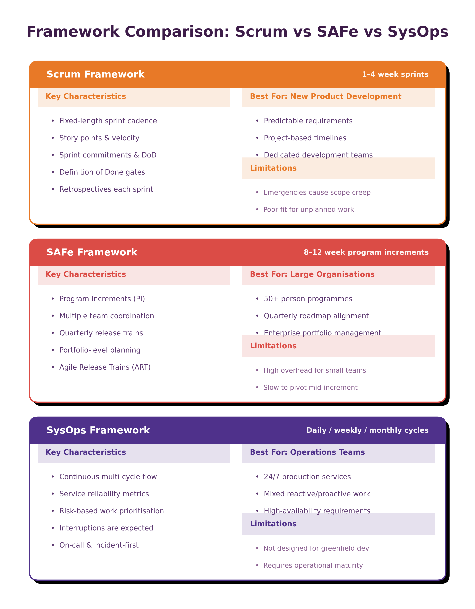
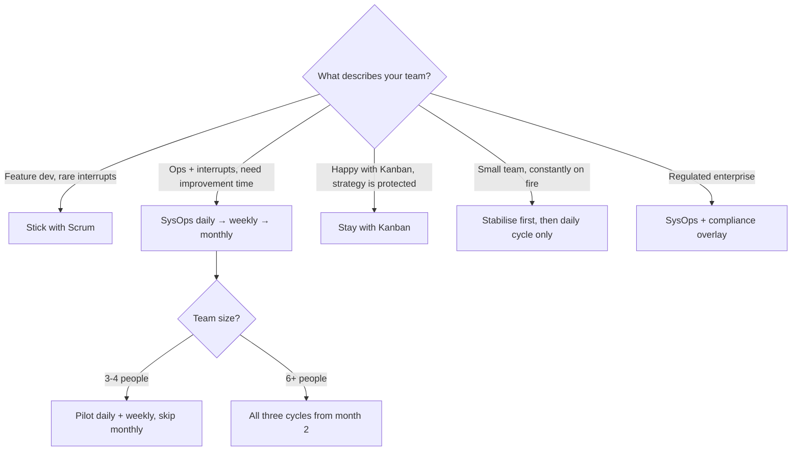
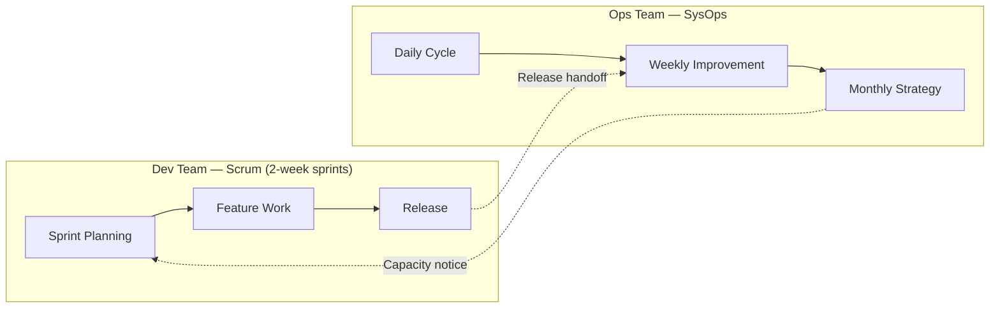

## 🎯 Learning Objectives

By the end of this chapter, you will understand:

- Key differences between Scrum, SAFe, and SysOps frameworks
- Why traditional metrics don't work for operations teams
- How to communicate framework benefits to stakeholders
- When to use which approach for different types of work

> **Principles in play.** Every comparison in this chapter is judged against the same yardstick: does the methodology respect _Service Reliability First_ and _Continuous Availability_ ([Chapter 2](chapter-02-principles.md))? That's the lens here — not feature-counting.

## 📊 Framework Comparison Overview

The comparison above illustrates fundamental differences between traditional agile approaches and the SysOps Framework. While each methodology has its place, understanding when and how to apply them is crucial for team success.

A quick disclaimer before the knives come out: this chapter is not a hit piece on Scrum. Scrum is superb at what it was built for — a team of developers turning a backlog into shipped features on a steady rhythm. The problem isn't Scrum; it's using a fishing rod to dig a trench. The tool is fine. We're just doing different work.

### Quick Selection Guide

Not sure whether SysOps is right for you? Use this decision table:

| Your team looks like... | Start with... |
|---|---|
| Feature-factory squad, clean 2-week sprints, rare interruptions | Scrum — SysOps is not for you |
| Ops team drowning in interrupts, no time for improvements | SysOps — daily cycle first, then pilot |
| Platform/SRE team with mixed planned/unplanned work | SysOps — all three cycles |
| Small team (2-3 people), everything is on fire | Stabilise first, then SysOps daily cycle only |
| Enterprise ops with regulated compliance requirements | SysOps + compliance overlay (Chapter 10) |
| Kanban team, happy with flow, strategic work is protected | Stay with Kanban — monitor for when it breaks |
| Hybrid: dev team uses Scrum, ops team supports them | Scrum for dev, SysOps for ops — see hybrid patterns below |

> **Diagram**: Methodology selection flowchart — team answers 3 questions to determine whether SysOps, Scrum, Kanban, or a hybrid fits best

## 🏃‍♂️ Scrum vs SysOps Framework

### Work Structure

**Scrum**: Fixed sprints (1-4 weeks) with defined start and end points. All work must fit into these containers, regardless of type or urgency.

**SysOps**: Continuous flow with three overlapping cycles (daily, weekly, monthly). Work flows naturally into the appropriate cycle based on its characteristics.

**Why This Matters**: Operations work doesn't respect sprint boundaries. A critical security vulnerability doesn't wait for sprint planning, and infrastructure migrations can't be artificially compressed into 2-week sprints.

### Planning Approach

**Scrum**: Sprint planning at the start of each sprint, with commitment to a fixed scope of work.

**SysOps**: Continuous planning with cycle reviews. Planning happens at multiple time horizons simultaneously.

**Real-World Impact**: When a major incident occurs mid-sprint, Scrum teams face the choice between abandoning sprint commitments or delaying incident response. SysOps teams handle incidents within their daily cycle while continuing improvement work in the weekly cycle.

### Response to Interruptions

**Scrum**: Interruptions are "scope creep" that threatens sprint success. Emergency protocols exist but are treated as exceptions.

**SysOps**: Interruptions are expected and planned for. The framework includes built-in protocols for immediate response without disrupting ongoing work.

**Example**: A database server starts showing signs of failure on Tuesday of a 2-week sprint. In Scrum, this becomes an emergency that "breaks" the sprint. In SysOps, this is handled in the daily operations cycle while weekly improvements and monthly strategic work continue normally.

> There's a particular sound a Scrum team makes when production breaks mid-sprint. It's the sound of a burndown chart being quietly redrawn while everyone agrees not to mention velocity at the retro. SysOps simply removes the theatre: the incident was always going to happen, so we built a place for it to go.

## 🏢 SAFe vs SysOps Framework

### Scale and Coordination

**SAFe**: Designed for large-scale development efforts with multiple teams working on related products. Uses Program Increments (8-12 weeks) to coordinate work.

**SysOps**: Designed for operations teams of any size. Can scale up or down but maintains focus on operational realities rather than development coordination.

### Change Management

**SAFe**: Program-level change management with quarterly planning events. Changes require coordination across multiple teams and stakeholders.

**SysOps**: Risk-assessed continuous deployment with immediate response capabilities. Changes are evaluated based on operational impact rather than program coordination.

**When SAFe Makes Sense for Ops**: Large organizations with multiple operations teams supporting related services may benefit from SAFe's coordination mechanisms, but individual teams should still use SysOps practices for their daily work.

## 🌊 Kanban vs SysOps Framework

### Why Kanban Alone May Not Be Sufficient

**Kanban**: Visualizes workflow with a continuous pull system (To Do → In Progress → Done). Handles interruptions natively by managing WIP (Work In Progress) limits and doesn't force scope boundaries.

**SysOps**: Adds multi-horizon planning (daily, weekly, monthly) and structured strategic focus beyond reactive work management.

### Comparison Details

| Aspect                   | Kanban                                  | SysOps                                         |
| ------------------------ | --------------------------------------- | ---------------------------------------------- |
| **Work Type Handling**   | Single flow, priority-based             | Three parallel cycles (daily/weekly/monthly)   |
| **Planning Horizon**     | Reactive, continuous pull               | Multi-level (immediate, short-term, strategic) |
| **Strategic Work**       | Difficult to protect from interruptions | Monthly cycle dedicated to strategy            |
| **Metrics Focus**        | Flow time, throughput, WIP              | Service reliability, efficiency, AND flow      |
| **Maturity Guidance**    | Minimal                                 | Explicit five-level maturity model             |
| **Management Practices** | Not addressed                           | Twelve core practices defined                     |
| **When to Use**          | Stable, well-defined processes          | Mixed planned/unplanned work environments      |

### Real-World Scenario

A typical operations team using Kanban might have a board: [To Do] → [Building] → [Testing] → [Done]

**Problem**: Urgent security patches, critical incident responses, and architectural decisions get stuck behind routine tasks. Higher-priority items require WIP adjustment, but strategic thinking still gets crowded out.

**SysOps Approach**:

- **Daily Cycle**: Security patches, incident response
- **Weekly Cycle**: Build automation, testing improvements
- **Monthly Cycle**: Architecture decisions, capacity planning

This protects strategic work from being consumed by daily urgencies.

### When Kanban Works Well for Ops

- Team has stable service with predictable incident volume
- Interruptions are manageable (<20% of time)
- Strategic planning is minimal
- Team is mature with strong discipline

### When SysOps Adds Value Over Kanban

- Significant unplanned incident load (>20% of time)
- Need to protect strategic/architectural work
- Managing multiple service tiers with different SLAs
- Need explicit maturity progression framework

---

## 🔴 Site Reliability Engineering (SRE) vs SysOps Framework

### Important Relationship Note

SysOps Framework and SRE are **not competing approaches** — SRE practices should be embedded within SysOps operations. This section clarifies how they relate.

### Core SRE Concepts

| SRE Concept                  | What It Means                                                                 |
| ---------------------------- | ----------------------------------------------------------------------------- |
| Error budgets                | Maximum acceptable downtime per period (e.g., 99.9% SLO = 43 minutes/month)   |
| Toil measurement             | Manual, repetitive work that doesn't provide long-term value                  |
| Production readiness reviews | Ensuring systems meet operational standards before deployment                 |
| Blameless post-mortems       | Learning-focused incident analysis                                            |

### How SysOps Incorporates SRE

| SRE Practice                    | SysOps Integration                                      |
| ------------------------------- | ------------------------------------------------------- |
| **Error budgets**               | Chapter 7: Service reliability metrics & SLO compliance |
| **Toil measurement**            | Chapter 3: Automation targets in daily/weekly cycles    |
| **Production readiness**        | Chapter 6: Service level management practice            |
| **Blameless post-mortems**      | Chapter 6: Incident management practice process         |
| **Automated incident response** | Chapter 3: Daily cycle automation                       |
| **Service maturity levels**     | Chapter 6: Practice maturity model                      |

### Key Difference

**SRE** is a set of practices developed at Google for managing large-scale systems. **SysOps Framework** is a methodology that provides operational cycles, management practices, and organizational structure. SRE practices fit naturally into the SysOps framework:

- Error budgets inform monthly strategy planning
- Toil reduction is a weekly improvement cycle goal
- Post-mortem learnings feed back into practice maturity assessment
- Production readiness is built into the Service Level Management practice

### Organizations Using Both

Most organizations successful with SRE are actually practicing a hybrid: SRE's error budget and toil concepts applied within a multi-cycle operational structure similar to SysOps. Formalizing this with explicit cycles and practices increases adoption and sustainability.

---

## 📈 Success Metrics: Why Traditional Metrics Fail Operations Teams

### The Velocity Problem

**Traditional Metric**: Sprint velocity (story points completed per sprint)

**Why It Fails**: Operations work varies wildly in complexity and urgency. A 30-minute password reset and a 30-hour datacenter migration can't be meaningfully compared using story points.

**SysOps Alternative**: Service reliability metrics (uptime, MTTR, SLO compliance) combined with operational efficiency measures (automation coverage, toil reduction).

### The Commitment Problem

**Traditional Metric**: Sprint commitment achievement (percentage of committed work completed)

**Why It Fails**: Operations teams can't commit to work when they don't control when emergencies occur. Failed commitments due to incidents create artificial failure metrics.

**SysOps Alternative**: Response effectiveness metrics (incident response time, resolution rate) combined with continuous improvement measures (improvements implemented, process enhancements).

### The Burndown Problem

**Traditional Metric**: Sprint burndown charts showing work remaining over time

**Why It Fails**: Operations work doesn't "burn down" - it's continuous. New issues arise constantly, making burndown charts meaningless.

**SysOps Alternative**: Service health trends (availability over time, performance improvements) combined with capacity utilization metrics.

> **Warning.** Don't quietly keep reporting velocity "just for continuity" while you transition. Metrics are incentives in disguise — whatever you put on the executive slide is what the team will optimise for. Keep velocity alive and you'll keep getting velocity behaviour, no matter what the new framework says on the cover.

## 🎮 Interactive Comparison Exercise

**Scenario**: Your operations team supports a critical customer service application. This week, you face:

1. **Planned Work**: Migrate database to new hardware (estimated 20 hours)
2. **Improvement Work**: Automate daily backup verification (estimated 8 hours)
3. **Strategic Work**: Evaluate new monitoring platform (estimated 16 hours)

**Interruption**: Tuesday morning - authentication service fails, affecting 50% of users

### How Each Framework Handles This:

**Scrum Response**:

- Stop current sprint work
- Emergency sprint planning session
- Re-estimate remaining work
- Likely miss sprint commitments
- Retrospective focuses on "what went wrong"

**SysOps Response**:

- Handle authentication failure in daily operations cycle
- Continue database migration planning in weekly cycle
- Monitoring evaluation continues in monthly cycle
- No "missed commitments" - each cycle handles appropriate work

**Exercise Questions**:

1. Which approach minimizes stress and context switching?
2. Which provides better stakeholder communication?
3. Which enables faster recovery and learning?

## 🔄 When to Use Each Approach

### Use Traditional Agile When:

- **Development-focused work**: Building new features or applications
- **Predictable scope**: Requirements can be defined and estimated accurately
- **Controlled timeline**: Work can be scheduled at team's discretion
- **Project-based work**: Clear beginning, middle, and end

### Use SysOps Framework When:

- **Operations-focused work**: Maintaining, monitoring, and improving existing systems
- **Mixed work types**: Combination of planned and unplanned work
- **Service availability requirements**: 24/7 or high-availability expectations
- **Interrupt-driven environment**: Regular emergencies and urgent requests

### When Not to Use SysOps

SysOps is not a universal replacement. It is wrong for some teams, and honest about it:

| Situation | Why SysOps is the wrong fit | What to use instead |
|---|---|---|
| **Pure product development** — one product, one backlog, rare production interrupts | SysOps cycles add unnecessary structure to work that already fits a sprint cadence | Scrum, Kanban |
| **Individual contributor without a team** | The framework assumes team handoffs and shared responsibility. A solo operator needs lighter structure. | Personal kanban, Getting Things Done |
| **Team in active crisis** — ongoing outage, security breach, or restructuring | Implementing a new framework during a crisis splits attention. Stabilise first, then adopt. | Incident response procedures, then revisit SysOps |
| **No management support at all** | Without leadership buy-in for protected improvement time, the weekly and monthly cycles will fail | Start with daily cycle only, build evidence, then negotiate |
| **Fully outsourced operations** with no internal team | The framework is designed for teams that own their services. Managed service providers need different coordination patterns. | ITIL 4, vendor governance frameworks |

### Hybrid Approaches

Some teams successfully combine approaches:

- **Development projects**: Use Scrum for new system development
- **Operations work**: Use SysOps for ongoing maintenance and support
- **Cross-functional teams**: Different team members may use different frameworks

### Hybrid Operating Model Patterns

For teams that need to bridge development and operations, here are three proven hybrid patterns:

**Pattern 1: Dev-Scrum / Ops-SysOps (side by side)**

A development team runs Scrum for product features; an operations team runs SysOps for infrastructure, reliability, and support. They share a weekly coordination touchpoint where the dev team communicates upcoming releases and the ops team communicates capacity impacts or risks.

> **Diagram**: Dev-Scrum / Ops-SysOps hybrid — dev sprint planning → feature work → release handoff to ops weekly cycle → ops monthly strategy → capacity notice back to dev

**Pattern 2: Unified team, dual cadence (single team)**

A single team owns both development and operations. They use a 2-week iteration for planned feature work (Scrum-like) while running a parallel daily operations cycle for interrupts. The daily cycle always takes priority; the 2-week iteration absorbs the leftover capacity. This is harder than it sounds and requires explicit WIP limits per person.

**Pattern 3: Platform team as internal provider (product model)**

The infrastructure/platform team treats the development teams as their customers. The platform team runs SysOps internally, with a monthly strategy cycle that aligns to the product roadmap. Development teams interact through a self-service portal (see Chapter 8 — platform engineering) and an SLA rather than through shared sprint planning.

**Choosing a hybrid pattern**:

| If you have... | Use pattern |
|---|---|
| Separate dev and ops teams | Pattern 1 (side by side) |
| A single team doing both | Pattern 2 (dual cadence) — only if team is 5+ people |
| A platform team serving product teams | Pattern 3 (internal provider) |

## 📊 Stakeholder Communication Differences

### Traditional Agile Stakeholder Updates

- **Frequency**: End of sprint (every 1-4 weeks)
- **Format**: Sprint review with demo and burndown charts
- **Focus**: Features completed and velocity trends
- **Challenges**: Difficulty explaining operational work that doesn't produce "demos"

### SysOps Stakeholder Updates

- **Frequency**: Multiple levels (daily status, weekly improvements, monthly strategy)
- **Format**: Service health reports, improvement summaries, strategic progress
- **Focus**: Service reliability, operational improvements, strategic initiatives
- **Benefits**: Better alignment with business continuity and risk management

### Sample Stakeholder Communication

**Traditional Agile**: "We completed 23 story points this sprint, but missed our commitment of 28 points due to production issues."

**SysOps**: "We maintained 99.97% uptime this month, implemented automated failover for the payment system, and completed the security framework evaluation ahead of schedule."

### Stakeholder Translation Kit

Different audiences need different framing. Here is a cheat sheet for explaining the framework to each group:

**To your manager**:
> "We are replacing sprint-based planning with a model that has separate tracks for reactive work, improvements, and strategy. This means fewer missed commitments, measurable improvement every week, and a clear story about what the team is doing — instead of a retro where we apologise for production incidents."

**To an executive**:
> "The framework protects time for improvements instead of letting firefighting consume everything. Teams using it typically reduce incident frequency by addressing root causes systematically. The monthly cycle aligns operations work to business priorities."

**To a development team**:
> "It is not a competitor to Scrum — it is what ops uses so your sprints stop getting disrupted by infrastructure fires. A stable platform team means fewer mid-sprint production surprises for you."

**To a new hire**:
> "We work in three rhythms: daily is for keeping things running, weekly is for making things better, monthly is for big changes. You will be in the daily cycle first. Once you know the systems, you will rotate into improvements."

**To a stakeholder asking "why are you changing methodology?"**:
> "Currently, every incident makes our sprint plan wrong. We spend retros explaining why we missed commitments — the same reason every time. This framework stops pretending incidents are exceptional and gives them a proper place, so our planned work can actually get done."

## 🏆 Real-World Case Studies

> The following are documented, publicly verifiable industry cases. They are included to illustrate the principles discussed in this chapter — not as endorsements, and not as direct accounts of the SysOps Framework, which is a synthesised model. Each draws on the organisation's own primary-source material.

### Case Study 1: Google SRE and Error Budgets — Operations Needs Its Own Model

When Google scaled, it found that running large production services could not be managed as an extension of feature-sprint development: the incentives pulled in opposite directions. Product development is measured on velocity (ship features fast), while the team responsible for reliability is measured on stability (resist risky change). Rather than forcing operations into a development cadence, Google built Site Reliability Engineering (SRE), with the **error budget** as its central mechanism ([Google SRE Book, "Embracing Risk"](https://sre.google/sre-book/embracing-risk/)).

**How it works**:

- Product management defines a Service Level Objective (e.g., 99.99% availability), which implies a budget of acceptable unreliability for the quarter.
- Actual reliability is measured by monitoring, not opinion.
- While budget remains, new releases ship freely; when the budget is exhausted, releases slow or halt until reliability is restored.

**Why it matters for SysOps**: Google's experience validates the core argument of this chapter — operational reliability is _primary work_ with its own objective metrics, not "scope creep" against a feature backlog. The error budget removes the politics from the reliability-versus-velocity debate by making the trade-off explicit and shared, exactly the kind of operations-first framing the SysOps Framework's cycles are designed to support. (Error budgets and SLOs are covered further in [Chapter 7](chapter-07-metrics.md).)

### Case Study 2: Knight Capital — The Cost of Treating Operations as an Afterthought

On 1 August 2012, the trading firm Knight Capital deployed new code to its automated equity order router in preparation for the NYSE's new Retail Liquidity Program. The deployment reactivated a defective, long-dead code path ("Power Peg") that had been left in the system since 2005. In the **first 45 minutes** after the market opened, the router sent **more than 4 million orders** while attempting to fill just **212 customer orders**, traded over 397 million shares, and produced a loss of **more than $460 million** — nearly destroying the firm, which was acquired shortly afterward ([SEC Press Release 2013-222](https://www.sec.gov/news/press-release/2013-222); [SEC Order 34-70694](https://www.sec.gov/litigation/admin/2013/34-70694.pdf)).

Critically, the SEC found the firm "did not have adequate controls and procedures for code deployment and testing," and that **97 automated warning emails** generated before the market opened went unheeded.

**Why it matters for SysOps**: Knight Capital is the cautionary inverse of the chapter's thesis. When deployment discipline, change management, and alert follow-through are treated as secondary to shipping, the operational risk does not disappear — it accumulates until it surfaces catastrophically. The SysOps Framework deliberately elevates these activities (release management, monitoring, and change control — see [Chapter 6](chapter-06-practices.md)) to first-class work precisely because the cost of doing otherwise can be existential.

## ⚖️ Framework Selection Criteria

### Organizational Factors

- **Size**: Smaller teams may not need SAFe's coordination overhead
- **Industry**: Regulated industries may require different documentation approaches
- **Culture**: Risk-tolerant vs. risk-averse cultures affect framework choice
- **Maturity**: Teams new to structured approaches may need simpler frameworks

### Technical Factors

- **System complexity**: More complex systems require more operational focus
- **Change frequency**: High-change environments need more flexible approaches
- **Availability requirements**: Higher availability needs favor operations-centric frameworks
- **Automation level**: More automated environments can handle more ambitious cycles

### Work Type Analysis

Create a simple analysis of your team's work:

| Work Type           | Percentage | Predictability | Urgency | Best Framework |
| ------------------- | ---------- | -------------- | ------- | -------------- |
| New development     | 20%        | High           | Low     | Scrum          |
| Planned maintenance | 30%        | Medium         | Medium  | SysOps Weekly  |
| Incident response   | 25%        | Low            | High    | SysOps Daily   |
| Strategic projects  | 25%        | Medium         | Low     | SysOps Monthly |

## 🚀 Migration Strategies

### From Scrum to SysOps

1. **Start with daily operations cycle** - most teams already do this informally
2. **Add weekly improvement cycle** - formalize existing improvement efforts
3. **Introduce monthly strategy cycle** - elevate strategic planning
4. **Transition metrics gradually** - maintain some familiar measures during transition

> **In practice.** Migrate one cycle at a time, not all three on a Monday. Teams that try to switch everything at once usually end up with three half-built cycles and a credibility problem. Get the daily cycle genuinely working — boring, reliable, trusted — before you ask anyone to take the weekly or monthly seriously.

### From Waterfall to SysOps

1. **Introduce monitoring and feedback loops** first
2. **Implement daily operations cycle** for immediate needs
3. **Add improvement cycles** for continuous enhancement
4. **Scale up strategic cycles** as team matures

### Hybrid Implementations

- **Project teams**: Use Scrum for projects, SysOps for operations
- **Platform teams**: Use SysOps for platform operations, Scrum for platform development
- **Cross-functional teams**: Different roles use appropriate frameworks

## 🎯 Chapter Summary

The comparison between traditional agile methodologies and the SysOps Framework highlights fundamental differences in approach, metrics, and stakeholder communication. Understanding these differences helps teams choose the right framework for their work type and organizational context.

The key insight is that there's no one-size-fits-all solution. The best methodology is the one that matches how the work actually gets done, acknowledges the real constraints and requirements of the team, and provides value to both the team and the organization.

For operations teams, this usually means moving away from development-centric frameworks toward approaches designed specifically for operational realities. However, the transition should be thoughtful and gradual, with clear communication about why the change benefits everyone involved.

## 🔮 Looking Ahead

In the next chapter, we'll dive into the practical aspects of implementing the SysOps Framework, including a detailed roadmap, change management strategies, and success metrics for the transition process.

## 💭 Reflection Questions

1. **Current State**: Which framework most closely matches your team's current practices?
2. **Gap Analysis**: What are the biggest gaps between your current approach and your ideal methodology?
3. **Stakeholder Impact**: How would changing frameworks affect your relationships with stakeholders and other teams?

---

**🎮 Gamification Element - Chapter 4 Badge**
_Complete the work type analysis for your team and create a framework selection recommendation to earn the "Framework Analyst" badge._

---

_[← Previous: Chapter 3 - Framework Structure](chapter-03-structure.md) | [Next: Chapter 5 - Implementation Strategy →](chapter-05-implementation.md)_
