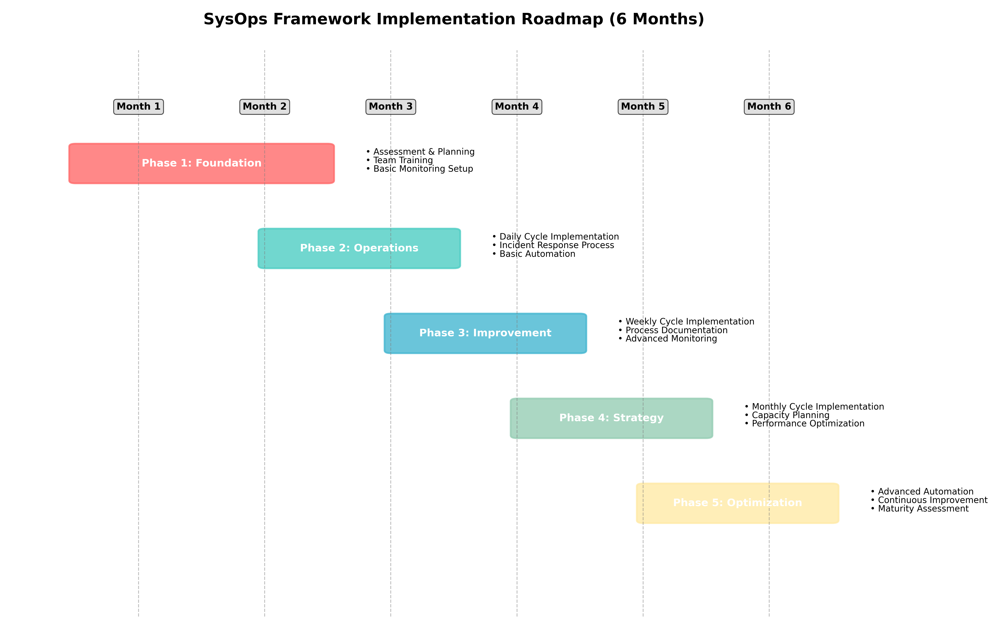

> *"A journey of a thousand miles begins with a single step, but you still need a map."*

## 🎯 Learning Objectives

By the end of this chapter, you will understand:
- The six-month implementation roadmap for the SysOps Framework
- How to manage change without disrupting ongoing operations
- Key milestones and success criteria for each phase
- Common implementation challenges and how to overcome them

## 🗺️ The Implementation Roadmap

Implementing the SysOps Framework requires a systematic, phased approach that minimizes disruption to ongoing operations while building new capabilities. The roadmap above shows six parallel tracks running over six months, each contributing to successful framework adoption.

## 🔍 Phase 1: Foundation and Assessment (Month 1)

### Foundation Track
**Objective**: Establish the groundwork for framework implementation

**Key Activities**:
- Current state assessment of team practices and capabilities
- Stakeholder alignment and communication about framework benefits
- Team readiness evaluation and initial training
- Resource allocation and timeline planning

**Deliverables**:
- Current state assessment report
- Implementation plan and timeline
- Stakeholder communication materials
- Team training schedule

**Success Criteria**:
- 100% of team members understand framework basics
- Leadership commitment secured
- Implementation plan approved
- Baseline metrics established

### Assessment Deep Dive

#### Team Readiness Assessment
Use this checklist to evaluate your team's readiness:

**Technical Readiness**:
- [ ] Existing monitoring and alerting systems
- [ ] Documentation and knowledge management practices
- [ ] Automation tools and capabilities
- [ ] Incident response procedures
- [ ] Change management processes

**Cultural Readiness**:
- [ ] Team openness to new approaches
- [ ] Leadership support for change
- [ ] Stakeholder understanding of operational challenges
- [ ] Current team collaboration and communication patterns
- [ ] Willingness to invest time in improvement

**Organizational Readiness**:
- [ ] Clear service definitions and ownership
- [ ] Defined service level expectations
- [ ] Existing metrics and measurement practices
- [ ] Resource availability for implementation
- [ ] Integration with other teams and processes

#### Baseline Metrics Collection
Before implementing changes, establish baseline measurements:

**Service Reliability**:
- Current uptime/availability percentages
- Mean Time To Recovery (MTTR) for incidents
- Incident frequency and severity distribution
- Service Level Objective compliance rates

**Team Performance**:
- Time allocation between planned and unplanned work
- Documentation coverage and quality
- Knowledge transfer effectiveness
- Team satisfaction and burnout indicators

**Operational Efficiency**:
- Manual task frequency and time consumption
- Change success rates and rollback frequency
- Monitoring effectiveness and false positive rates
- Stakeholder satisfaction with IT services

## 🏗️ Phase 2: Core Process Setup (Months 2-3)

### Month 2: Daily Operations Foundation

**Core Processes Track**:
- Implement daily operations cycle (Monitor → Respond → Document → Review)
- Establish incident response procedures and escalation paths
- Create service catalog and critical service definitions
- Set up basic communication and handoff procedures

**Tools Track**:
- Deploy or improve monitoring and alerting systems
- Implement basic automation for routine tasks
- Set up incident tracking and documentation systems
- Create centralized knowledge management platform

**Team Track**:
- Begin cross-training on critical systems
- Establish on-call rotation and handoff procedures
- Create role definitions for daily operations cycle
- Start regular daily review meetings

**Metrics Track**:
- Implement basic service health dashboards
- Set up incident tracking and reporting
- Create daily operations effectiveness measures
- Begin trend analysis and pattern identification

### Month 3: Weekly Improvement Integration

**Core Processes Track**:
- Add weekly improvement cycle (Plan → Execute → Measure → Improve)
- Integrate daily operations insights with weekly planning
- Establish improvement prioritization criteria
- Create resource allocation guidelines for improvement work

**Tools Track**:
- Enhance automation capabilities
- Implement change management and testing procedures
- Set up measurement and tracking for improvements
- Create templates and tools for improvement planning

**Team Track**:
- Expand cross-training to include improvement techniques
- Establish improvement project management practices
- Create knowledge sharing and collaboration processes
- Begin specialized skill development planning

**Metrics Track**:
- Add improvement effectiveness tracking
- Create before/after comparison capabilities
- Implement trend analysis for improvement impact
- Set up team satisfaction and engagement measurement

### 🎮 Interactive Exercise: Process Integration Challenge

**Scenario**: Your team currently handles incidents reactively and struggles to find time for improvements. You're implementing the SysOps Framework.

**Week 1 Challenge**:
- Monday: Database performance degradation (4 hours to resolve)
- Wednesday: Security patch deployment (6 hours)
- Friday: Network equipment failure (8 hours)

**Questions**:
1. How would you structure daily operations cycles around these incidents?
2. What patterns would you identify for weekly improvement planning?
3. How would you maintain team morale while implementing new processes?

**Framework Response**:
- **Daily Cycle**: Handle each incident with structured response, documentation, and review
- **Weekly Cycle**: Identify patterns (database monitoring gaps, patch testing improvements, network redundancy needs)
- **Team Support**: Celebrate successful incident responses while planning improvements to prevent recurrence

## 🚀 Phase 3: Development and Maturity (Months 4-6)

### Month 4: Strategic Integration

**Core Processes Track**:
- Introduce monthly strategy cycle (Assess → Design → Implement → Evaluate)
- Integrate all three cycles into cohesive workflow
- Establish stakeholder communication and reporting procedures
- Create governance and decision-making frameworks

**Tools Track**:
- Implement advanced automation and orchestration
- Deploy comprehensive monitoring and analytics platforms
- Create integrated workflow and collaboration tools
- Set up predictive analytics and capacity planning tools

**Team Track**:
- Develop specialized expertise and leadership roles
- Create mentorship and knowledge transfer programs
- Establish career development and certification paths
- Build cross-functional collaboration capabilities

**Metrics Track**:
- Implement comprehensive KPI dashboards
- Create business value and cost effectiveness measures
- Set up predictive analytics and trend forecasting
- Establish benchmarking and continuous improvement metrics

### Month 5: Advanced Capabilities

**Focus Areas**:
- Advanced automation and self-healing systems
- Predictive monitoring and proactive issue prevention
- Strategic technology evaluation and adoption
- Team expertise development and specialization

**Key Milestones**:
- 80% of routine tasks automated
- Proactive issue detection preventing 50% of potential incidents
- Strategic technology roadmap established
- Team members achieving advanced certifications

### Month 6: Full Framework Adoption

**Achievement Targets**:
- All three operational cycles running smoothly
- Framework integrated with organizational processes
- Team operating with high autonomy and expertise
- Continuous improvement culture fully established

**Success Indicators**:
- Service reliability targets consistently met
- Team satisfaction and engagement high
- Stakeholder confidence in operations capabilities
- Framework practices becoming organizational standards

## 🎯 Success Criteria and Milestones

### Month 1 Milestones
- [ ] Current state fully assessed and documented
- [ ] Implementation plan approved by leadership
- [ ] Team trained on framework basics
- [ ] Baseline metrics established
- [ ] Initial stakeholder communications completed

### Month 2 Milestones
- [ ] Daily operations cycle implemented
- [ ] Basic monitoring and alerting operational
- [ ] Incident response procedures defined
- [ ] Knowledge management system deployed
- [ ] Daily review meetings established

### Month 3 Milestones
- [ ] Weekly improvement cycle integrated
- [ ] First improvement projects completed
- [ ] Cross-training program initiated
- [ ] Improvement effectiveness measurement active
- [ ] Team showing adoption of new practices

### Month 4 Milestones
- [ ] Monthly strategy cycle introduced
- [ ] All cycles running in parallel
- [ ] Advanced automation capabilities deployed
- [ ] Strategic planning processes established
- [ ] Stakeholder satisfaction improving

### Month 5 Milestones
- [ ] Advanced capabilities operational
- [ ] Predictive analytics providing value
- [ ] Team expertise development visible
- [ ] Process optimization showing results
- [ ] Cultural transformation evident

### Month 6 Milestones
- [ ] Full framework adoption achieved
- [ ] Business value clearly demonstrated
- [ ] Team autonomy and expertise established
- [ ] Continuous improvement culture embedded
- [ ] Framework ready for scaling or replication

## 🚧 Common Implementation Challenges

### Challenge 1: Resistance to Change
**Symptoms**: Team members preferring old processes, skepticism about framework benefits, reluctance to invest time in new approaches

**Solutions**:
- Start with willing team members as champions
- Demonstrate quick wins and immediate benefits
- Address concerns directly and honestly
- Provide adequate training and support
- Celebrate successes and learn from setbacks

### Challenge 2: Resource Constraints
**Symptoms**: No time for implementation activities, competing priorities, limited budget for tools or training

**Solutions**:
- Phase implementation to spread resource needs
- Start with low-cost, high-impact improvements
- Use framework implementation to identify resource optimization opportunities
- Demonstrate ROI to secure additional resources
- Leverage existing tools and capabilities where possible

### Challenge 3: Organizational Resistance
**Symptoms**: Leadership skepticism, conflicting priorities from other teams, resistance to changing metrics or reporting

**Solutions**:
- Build strong business case with clear benefits
- Start with pilot implementation to prove value
- Align framework benefits with organizational goals
- Engage stakeholders in framework design and implementation
- Communicate progress and results regularly

### Challenge 4: Technical Limitations
**Symptoms**: Inadequate monitoring tools, legacy systems that resist automation, integration challenges

**Solutions**:
- Prioritize tool improvements based on framework needs
- Implement gradual technical improvements alongside framework adoption
- Use framework implementation to justify technical investments
- Find creative workarounds for legacy system limitations
- Plan technical improvements as strategic initiatives

## 📊 Measuring Implementation Success

### Leading Indicators (Early Signs of Success)
- Team engagement and participation in framework activities
- Stakeholder feedback and support
- Process adherence and consistency
- Tool adoption and usage patterns
- Knowledge sharing and cross-training progress

### Lagging Indicators (Long-term Success Measures)
- Service reliability improvements
- Operational efficiency gains
- Team satisfaction increases
- Stakeholder confidence growth
- Business value demonstration

### Implementation Health Metrics
- **Adoption Rate**: Percentage of framework practices being used consistently
- **Process Maturity**: Assessment of how well each cycle is functioning
- **Tool Integration**: Level of automation and tool integration achieved
- **Team Capability**: Skills and expertise development progress
- **Cultural Change**: Evidence of cultural transformation and continuous improvement mindset

## 🔄 Adaptation and Customization

### Framework Customization Guidelines
- **Maintain Core Principles**: Don't compromise the fundamental values and principles
- **Adapt Cycle Timing**: Adjust cycle lengths based on your environment
- **Customize Metrics**: Use metrics that matter to your stakeholders
- **Scale Appropriately**: Adjust complexity based on team size and maturity
- **Integrate Organizationally**: Align with existing organizational processes where beneficial

### Industry-Specific Adaptations
- **Financial Services**: Enhanced compliance and audit trail requirements
- **Healthcare**: Patient safety and regulatory compliance integration
- **Manufacturing**: Integration with production planning and quality systems
- **Technology**: Alignment with development and product release cycles
- **Government**: Compliance with procurement and security regulations

## 🎯 Chapter Summary

Implementing the SysOps Framework requires careful planning, phased execution, and continuous adjustment based on results and feedback. The six-month roadmap provides a structured approach while maintaining flexibility for customization and adaptation.

Success depends on strong leadership support, team engagement, adequate resources, and a commitment to continuous improvement. The parallel tracks ensure that technical, process, and cultural changes happen simultaneously, creating a comprehensive transformation that addresses all aspects of operations work.

The key to successful implementation is starting with solid foundations, building capabilities gradually, and maintaining focus on the ultimate goal: creating sustainable, effective operations practices that serve both the team and the organization.

## 🔮 Looking Ahead

In the next chapter, we'll explore the essential management practices that support the SysOps Framework, including service level management, incident and problem management, and the other key practices that make the framework effective.

## 💭 Reflection Questions

1. **Readiness Assessment**: How ready is your team and organization for this level of change?
2. **Resource Planning**: What resources would you need to secure for successful implementation?
3. **Success Definition**: How would you measure success for your specific environment?

---

**🎮 Gamification Element - Chapter 5 Badge**
*Create a detailed implementation plan for your team, including timeline, resources, and success criteria, to earn the "Implementation Planner" badge.*

**📚 Additional Resources**
- Template: "Implementation Planning Workbook"
- Assessment: "Team and Organizational Readiness Evaluation"
- Case Study: "Successful SysOps Framework Implementation in 6 Months"

---
*[← Previous: Chapter 4 - Comparison](chapter-04-comparison.md) | [Next: Chapter 6 - Management Practices →](chapter-06-practices.md)*
