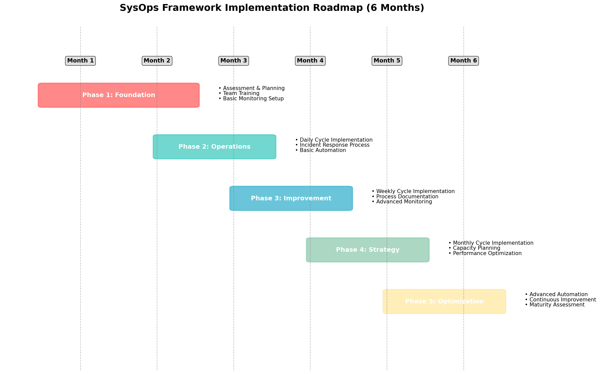

## 🎯 Learning Objectives

By the end of this chapter, you will understand:

- The six-month implementation roadmap for the SysOps Framework
- How to manage change without disrupting ongoing operations
- Key milestones and success criteria for each phase
- Common implementation challenges and how to overcome them

> **Principles in play.** A rollout that burns out the team betrays the very principles it's meant to install. Watch especially for _Automation and Efficiency_ and _Knowledge Sharing_ ([Chapter 2](chapter-02-principles.md)) — they're the two that make adoption stick rather than snap back the moment you stop pushing.

## 🗺️ The Implementation Roadmap

Implementing the SysOps Framework requires a systematic, phased approach that minimizes disruption to ongoing operations while building new capabilities. The roadmap above shows six parallel tracks running over six months, each contributing to successful framework adoption.

### Two Tracks: Pilot vs Full Rollout

There is no single adoption path. Choose based on your team's readiness:

| | **Track A: 30-Day Pilot** | **Track B: Full 180-Day Rollout** |
|---|---|---|
| **Who** | One team, testing the framework | Team(s) committed to full adoption |
| **Prerequisite** | 4+ yes signals on the readiness assessment in [Getting Started](../getting-started/) | Successful 30-day pilot completed |
| **Goal** | Prove the daily cycle works, measure improvement, decide | Institutionalise all three cycles + all 12 practices |
| **Owners** | Team lead (drives), on-call engineer (daily cycle), one stakeholder sponsor | Team lead + manager (joint), rotating improvement lead, exec sponsor |
| **Months** | 1 month | 6 months |

**If you have not run a pilot, start there.** The full 180-day plan assumes the pilot has already validated the approach for your context.

### Role-Based Responsibilities

| Role | Pilot | Full Rollout |
|---|---|---|
| **Team lead** | Drives the daily cycle, runs standalones, unblocks the team | Runs weekly improvement cycle, reports to manager, coordinates with other teams |
| **On-call engineer** | Owns the daily cycle's respond phase, logs incidents | Rotates as improvement lead, trains new team members |
| **Manager** | Provides air cover, protects improvement time, reviews pilot results | Owns monthly strategy cycle, secures budget, enforces framework adherence |
| **Executive sponsor** | Reviews pilot results, approves continuation | Champions cross-team adoption, removes organisational blockers |

## 🔍 Phase 1: Foundation and Assessment (Month 1)

### Foundation Track

**Objective**: Establish the groundwork for framework implementation

**Key Activities**:

- Current state assessment of team practices and capabilities
- Stakeholder alignment and communication about framework benefits
- Team readiness evaluation and initial training
- Resource allocation and timeline planning

**Deliverables**:

- Current state assessment report
- Implementation plan and timeline
- Stakeholder communication materials
- Team training schedule

**Success Criteria**:

- 100% of team members understand framework basics
- Leadership commitment secured
- Implementation plan approved
- Baseline metrics established

### Assessment Deep Dive

#### Team Readiness Assessment

Before changing a single process, find out where you actually stand — across three dimensions:

- **Technical readiness** — do you already have monitoring, documentation, automation, incident response, and change management, even if informal?
- **Cultural readiness** — is the team open to change, and does leadership genuinely back it (rather than just nodding in a meeting)?
- **Organizational readiness** — are services, ownership, and service-level expectations clear enough to build on?

Be ruthlessly honest here. A readiness assessment that flatters you is worse than no assessment at all, because it sells you confidence you haven't earned. The full tick-box version of all three lists — the one you print out and work through as a team — lives in **[Appendix A](chapter-13-appendices.md)**. Rule of thumb: if more than a third of any single list is unchecked, fix those gaps _before_ starting the roadmap, not during it.

#### Baseline Metrics Collection

Before implementing changes, establish baseline measurements:

**Service Reliability**:

- Current uptime/availability percentages
- Mean Time To Recovery (MTTR) for incidents
- Incident frequency and severity distribution
- Service Level Objective compliance rates

**Team Performance**:

- Time allocation between planned and unplanned work
- Documentation coverage and quality
- Knowledge transfer effectiveness
- Team satisfaction and burnout indicators

**Operational Efficiency**:

- Manual task frequency and time consumption
- Change success rates and rollback frequency
- Monitoring effectiveness and false positive rates
- Stakeholder satisfaction with IT services

## 🏗️ Phase 2: Core Process Setup (Months 2-3)

### Month 2: Daily Operations Foundation

**Core Processes Track**:

- Implement daily operations cycle (Monitor → Respond → Document → Review)
- Establish incident response procedures and escalation paths
- Create service catalog and critical service definitions
- Set up basic communication and handoff procedures

**Tools Track**:

- Deploy or improve monitoring and alerting systems
- Implement basic automation for routine tasks
- Set up incident tracking and documentation systems
- Create centralized knowledge management platform

**Team Track**:

- Begin cross-training on critical systems
- Establish on-call rotation and handoff procedures
- Create role definitions for daily operations cycle
- Start regular daily review meetings

**Metrics Track**:

- Implement basic service health dashboards
- Set up incident tracking and reporting
- Create daily operations effectiveness measures
- Begin trend analysis and pattern identification

### Month 3: Weekly Improvement Integration

**Core Processes Track**:

- Add weekly improvement cycle (Plan → Execute → Measure → Improve)
- Integrate daily operations insights with weekly planning
- Establish improvement prioritization criteria
- Create resource allocation guidelines for improvement work

**Tools Track**:

- Enhance automation capabilities
- Implement change management and testing procedures
- Set up measurement and tracking for improvements
- Create templates and tools for improvement planning

**Team Track**:

- Expand cross-training to include improvement techniques
- Establish improvement project management practices
- Create knowledge sharing and collaboration processes
- Begin specialized skill development planning

**Metrics Track**:

- Add improvement effectiveness tracking
- Create before/after comparison capabilities
- Implement trend analysis for improvement impact
- Set up team satisfaction and engagement measurement

### 🎮 Interactive Exercise: Process Integration Challenge

**Scenario**: Your team currently handles incidents reactively and struggles to find time for improvements. You're implementing the SysOps Framework.

**Week 1 Challenge**:

- Monday: Database performance degradation (4 hours to resolve)
- Wednesday: Security patch deployment (6 hours)
- Friday: Network equipment failure (8 hours)

**Questions**:

1. How would you structure daily operations cycles around these incidents?
2. What patterns would you identify for weekly improvement planning?
3. How would you maintain team morale while implementing new processes?

**Framework Response**:

- **Daily Cycle**: Handle each incident with structured response, documentation, and review
- **Weekly Cycle**: Identify patterns (database monitoring gaps, patch testing improvements, network redundancy needs)
- **Team Support**: Celebrate successful incident responses while planning improvements to prevent recurrence

## 🚀 Phase 3: Development and Maturity (Months 4-6)

### Month 4: Strategic Integration

**Core Processes Track**:

- Introduce monthly strategy cycle (Assess → Design → Implement → Evaluate)
- Integrate all three cycles into cohesive workflow
- Establish stakeholder communication and reporting procedures
- Create governance and decision-making frameworks

**Tools Track**:

- Implement advanced automation and orchestration
- Deploy comprehensive monitoring and analytics platforms
- Create integrated workflow and collaboration tools
- Set up predictive analytics and capacity planning tools

**Team Track**:

- Develop specialized expertise and leadership roles
- Create mentorship and knowledge transfer programs
- Establish career development and certification paths
- Build cross-functional collaboration capabilities

**Metrics Track**:

- Implement comprehensive KPI dashboards
- Create business value and cost effectiveness measures
- Set up predictive analytics and trend forecasting
- Establish benchmarking and continuous improvement metrics

### Month 5: Advanced Capabilities

**Focus Areas**:

- Advanced automation and self-healing systems
- Predictive monitoring and proactive issue prevention
- Strategic technology evaluation and adoption
- Team expertise development and specialization

> These roadmap milestones describe _when_ automation maturity is reached. The concrete tooling to get there (IaC, orchestration, GitOps, runbook automation, self-service platforms) is catalogued in [Chapter 8](chapter-08-tools.md); automation _coverage_ targets are measured per [Chapter 7](chapter-07-metrics.md); self-healing and AI-driven automation are explored in [Chapter 12](chapter-12-future.md).

**Key Milestones**:

- 80% of routine tasks automated
- Proactive issue detection preventing 50% of potential incidents
- Strategic technology roadmap established
- Team members achieving advanced certifications

### Month 6: Full Framework Adoption

**Achievement Targets**:

- All three operational cycles running smoothly
- Framework integrated with organizational processes
- Team operating with high autonomy and expertise
- Continuous improvement culture fully established

**Success Indicators**:

- Service reliability targets consistently met
- Team satisfaction and engagement high
- Stakeholder confidence in operations capabilities
- Framework practices becoming organizational standards

## 🎯 Success Criteria and Milestones

The roadmap boils down to a simple shape: **build the daily heartbeat first, layer improvement on top, then add strategy — and only then chase the advanced toys.** Teams that invert this order (buying the shiny self-healing automation platform in week one, before they can reliably handle a 3 a.m. page) tend to end up with an expensive dashboard nobody trusts.

At a glance, here's what "done" looks like for each phase:

- **Month 1 — Foundation:** assessed, planned, trained, baselined, and leadership on board.
- **Months 2–3 — Daily & weekly cadence:** the daily operations cycle runs, then the weekly improvement cycle joins it and starts paying off.
- **Month 4 — Strategy:** the monthly strategy cycle appears and all three cycles run in parallel.
- **Months 5–6 — Maturity:** advanced capabilities prove their value, culture shifts, and the framework becomes "just how we work" — ready to scale or replicate.

Each phase maps to the maturity levels in [Chapter 6](chapter-06-practices.md): expect practices to sit around Level 1–2 in Month 1, reach Level 3 (Defined) by Month 4, and stabilise at Level 4 (Managed) by Month 6, with a credible path to Level 5 (Optimizing).

> **The detailed, month-by-month milestone tracker** — the printable checklist with every box to tick — lives in **[Appendix B](chapter-13-appendices.md)**, alongside the maturity targets for each month. Keep the narrative here; keep the tick-boxes there.

## ⛔ Go/No-Go Decision Points

Check these at each phase boundary. If the criteria are not met, do not advance — adapt or pause.

| Phase boundary | Go criteria | No-go response |
|---|---|---|
| **End of pilot (Day 30)** | Daily cycle running consistently, 3+ incidents logged with documented response, team reports less chaos (even slightly), at least one improvement completed | Extend pilot by 2 weeks with adjusted scope, or stop and document why SysOps does not fit |
| **Pilot → Full rollout (Month 1 → 2)** | Pilot go decision made, manager agrees to protect improvement time, baseline metrics collected | Do not start full rollout. Address the blocker first (see [Getting Started — Readiness Gaps](../getting-started/#readiness-gaps-that-block-rollout)) |
| **End of Month 3** | Weekly cycle producing measurable improvements, at least one practice at maturity Level 2, team satisfaction stable or improving | Pause monthly cycle introduction. Spend Month 4 strengthening daily + weekly cycles. Reassess |
| **End of Month 4** | Monthly strategy cycle launched, first strategic initiative complete or in progress, stakeholder reporting is happening | Extend the monthly cycle pilot by one month with adjusted scope |
| **End of Month 6** | All three cycles running without active management, maturity Level 3+ on priority practices, team can articulate framework value without referencing the book | Accept Level 2 on some practices and plan targeted improvement for next quarter. Full maturity takes 12-18 months |

## ↩️ Rollback Plan

If the framework is not working after a genuine attempt, here is how to exit cleanly — without losing the improvements you have already made.

### When to Trigger a Rollback

Consider rolling back if:

1. **Team burnout increases** despite the framework — measured by survey or observed attrition
2. **Incident frequency or MTTR worsens** after 60 days of consistent practice (not during the learning curve)
3. **Stakeholder trust erodes measurably** — e.g., the business bypasses the team for operational decisions
4. **Management withdraws support for protected improvement time**, making the weekly cycle impossible

### Rollback Steps

1. **Stop the monthly strategy cycle first** — it has the least immediate impact
2. **Keep the weekly improvement cycle** but make it optional, not mandatory — document everything you automated
3. **Retain the daily operations cycle** — it is just disciplined operational practice that any team benefits from
4. **Keep every artifact**: incident logs, improvement records, metrics baselines. They are valuable regardless of framework
5. **Document why the rollback happened** — one page: what was tried, what broke, what was learned. This protects the next attempt (by you or someone else) from repeating the same mistakes

### What You Keep

Even in a rollback, the following are permanent improvements that no methodology change should undo:

- Incident logging discipline
- Post-incident reviews (even informal ones)
- Automation you built
- Documentation you created
- Cross-training completed
- Baseline metrics (they are valuable regardless of what comes next)

## 🚧 Common Implementation Challenges

> **Reality check.** Every one of the challenges below is really a people problem wearing a process costume. You can have a flawless roadmap and still stall because one influential skeptic decided this is "the latest thing management read about." Win the people and the process follows; win the process and ignore the people, and you'll be relaunching this in eighteen months.

### Challenge 1: Resistance to Change

**Symptoms**: Team members preferring old processes, skepticism about framework benefits, reluctance to invest time in new approaches

**Solutions**:

- Start with willing team members as champions
- Demonstrate quick wins and immediate benefits
- Address concerns directly and honestly
- Provide adequate training and support
- Celebrate successes and learn from setbacks

### Challenge 2: Resource Constraints

**Symptoms**: No time for implementation activities, competing priorities, limited budget for tools or training

**Solutions**:

- Phase implementation to spread resource needs
- Start with low-cost, high-impact improvements
- Use framework implementation to identify resource optimization opportunities
- Demonstrate ROI to secure additional resources
- Leverage existing tools and capabilities where possible

### Challenge 3: Organizational Resistance

**Symptoms**: Leadership skepticism, conflicting priorities from other teams, resistance to changing metrics or reporting

**Solutions**:

- Build strong business case with clear benefits
- Start with pilot implementation to prove value
- Align framework benefits with organizational goals
- Engage stakeholders in framework design and implementation
- Communicate progress and results regularly

### Challenge 4: Technical Limitations

**Symptoms**: Inadequate monitoring tools, legacy systems that resist automation, integration challenges

**Solutions**:

- Prioritize tool improvements based on framework needs
- Implement gradual technical improvements alongside framework adoption
- Use framework implementation to justify technical investments
- Find creative workarounds for legacy system limitations
- Plan technical improvements as strategic initiatives

## 📊 Measuring Implementation Success

### Leading Indicators (Early Signs of Success)

- Team engagement and participation in framework activities
- Stakeholder feedback and support
- Process adherence and consistency
- Tool adoption and usage patterns
- Knowledge sharing and cross-training progress

### Lagging Indicators (Long-term Success Measures)

- Service reliability improvements
- Operational efficiency gains
- Team satisfaction increases
- Stakeholder confidence growth
- Business value demonstration

### Implementation Health Metrics

| Metric           | What It Tracks                                                          |
| ---------------- | ----------------------------------------------------------------------- |
| Adoption rate    | Percentage of framework practices being used consistently               |
| Process maturity | Assessment of how well each cycle is functioning                        |
| Tool integration | Level of automation and tool integration achieved                       |
| Team capability  | Skills and expertise development progress                               |
| Cultural change  | Evidence of cultural transformation and continuous improvement mindset  |

## 🔄 Adaptation and Customization

### Framework Customization Guidelines

| Guideline                 | What It Means                                                     |
| ------------------------- | ---------------------------------------------------------------- |
| Maintain core principles  | Don't compromise the fundamental values and principles           |
| Adapt cycle timing        | Adjust cycle lengths based on your environment                   |
| Customize metrics         | Use metrics that matter to your stakeholders                     |
| Scale appropriately       | Adjust complexity based on team size and maturity                |
| Integrate organizationally | Align with existing organizational processes where beneficial   |

### Industry-Specific Adaptations

| Industry           | Adaptation Emphasis                                       |
| ------------------ | --------------------------------------------------------- |
| Financial services | Enhanced compliance and audit trail requirements          |
| Healthcare         | Patient safety and regulatory compliance integration      |
| Manufacturing      | Integration with production planning and quality systems  |
| Technology         | Alignment with development and product release cycles      |
| Government         | Compliance with procurement and security regulations      |

## 🎯 Chapter Summary

Implementing the SysOps Framework requires careful planning, phased execution, and continuous adjustment based on results and feedback. The six-month roadmap provides a structured approach while maintaining flexibility for customization and adaptation.

Success depends on strong leadership support, team engagement, adequate resources, and a commitment to continuous improvement. The parallel tracks ensure that technical, process, and cultural changes happen simultaneously, creating a comprehensive transformation that addresses all aspects of operations work.

The key to successful implementation is starting with solid foundations, building capabilities gradually, and maintaining focus on the ultimate goal: creating sustainable, effective operations practices that serve both the team and the organization.

## 🔮 Looking Ahead

In the next chapter, we'll explore the essential management practices that support the SysOps Framework, including service level management, incident and problem management, and the other key practices that make the framework effective.

## 💭 Reflection Questions

1. **Readiness Assessment**: How ready is your team and organization for this level of change?
2. **Resource Planning**: What resources would you need to secure for successful implementation?
3. **Success Definition**: How would you measure success for your specific environment?

---

**🎮 Gamification Element - Chapter 5 Badge**
_Create a detailed implementation plan for your team, including timeline, resources, and success criteria, to earn the "Implementation Planner" badge._

---

_[← Previous: Chapter 4 - Comparison](chapter-04-comparison.md) | [Next: Chapter 6 - Management Practices →](chapter-06-practices.md)_
