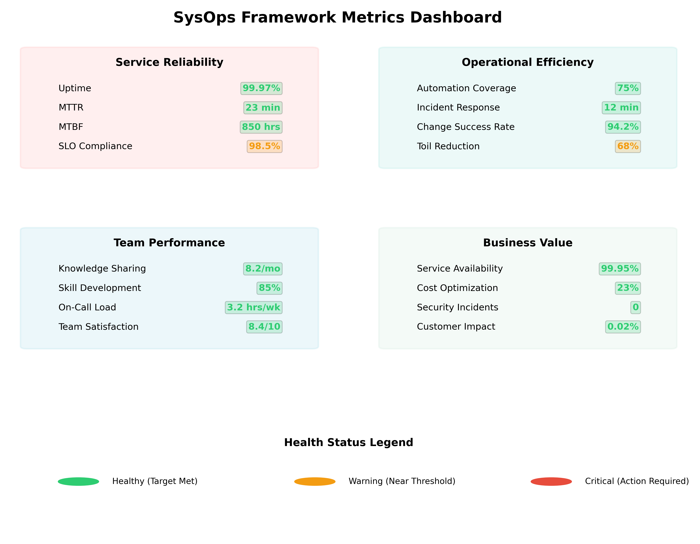

## 🎯 Learning Objectives

By the end of this chapter, you will understand:

- The four categories of SysOps Framework metrics
- How to design effective dashboards for different audiences
- Key performance indicators that align with operational goals
- How to measure framework implementation success

## 📊 The SysOps Metrics Framework



Traditional agile metrics like velocity and story points don't capture the value that operations teams provide. The SysOps Framework requires different metrics that reflect operational realities and demonstrate business value. Our metrics framework organizes measurements into four key categories, each serving different stakeholders and decision-making needs.

## 🛡️ Service Reliability Metrics

### Primary Indicators

**Uptime and Availability**

- **Definition**: Percentage of time services are operational and accessible
- **Target Range**: 99.9%+ for critical services, 99.5%+ for important services
- **Measurement**: Automated monitoring with synthetic transactions
- **Business Value**: Direct correlation to revenue and customer satisfaction

**Mean Time to Recovery (MTTR)**

- **Definition**: Average time from incident detection to service restoration
- **Target Range**: <30 minutes for critical services, <2 hours for standard services
- **Measurement**: Incident tracking from alert to resolution confirmation
- **Business Value**: Minimizes business impact of service disruptions

**Mean Time Between Failures (MTBF)**

- **Definition**: Average operational time between service failures
- **Target Range**: >720 hours for critical systems
- **Measurement**: Time tracking between incident occurrences
- **Business Value**: Indicates system stability and reliability investment effectiveness

**Service Level Objective (SLO) Compliance**

- **Definition**: Percentage of time meeting defined service level targets
- **Target Range**: 95%+ compliance across all defined SLOs
- **Measurement**: Automated calculation based on SLI data
- **Business Value**: Demonstrates commitment to service quality standards

**Error Budget Burn Rate**

- **Definition**: Rate at which reliability budget is being consumed
- **Target Range**: <50% of monthly budget consumed
- **Measurement**: Real-time tracking of error budget consumption
- **Business Value**: Balances reliability with innovation and change velocity

### Implementation Example

**Service**: Customer Payment Processing System

```yaml
SLOs:
  availability:
    target: 99.95%
    measurement_window: monthly
    current: 99.97%
  latency:
    target: 95th percentile < 500ms
    measurement_window: daily
    current: 320ms
  error_rate:
    target: < 0.1%
    measurement_window: hourly
    current: 0.03%

Error Budget:
  monthly_allowance: 22_minutes
  consumed_this_month: 8_minutes
  remaining: 14_minutes
  burn_rate: healthy
```

## ⚡ Operational Efficiency Metrics

### Automation and Process Metrics

**Automation Coverage**

- **Definition**: Percentage of routine tasks performed automatically
- **Target Range**: 70%+ of repetitive tasks automated
- **Measurement**: Task inventory with automation status tracking
- **Business Value**: Reduces manual effort and increases consistency

**Incident Response Time**

- **Definition**: Time from alert generation to initial human response
- **Target Range**: <15 minutes for critical alerts, <60 minutes for warnings
- **Measurement**: Timestamp analysis from monitoring to acknowledgment
- **Business Value**: Demonstrates operational readiness and responsiveness

**Change Success Rate**

- **Definition**: Percentage of changes implemented without causing incidents
- **Target Range**: 95%+ success rate for normal changes
- **Measurement**: Change tracking with incident correlation analysis
- **Business Value**: Shows process maturity and risk management effectiveness

**Capacity Utilization**

- **Definition**: Optimal resource usage without performance degradation
- **Target Range**: 60-80% utilization for most resources
- **Measurement**: Resource monitoring with performance correlation
- **Business Value**: Maximizes infrastructure investment while maintaining performance

**Tool Effectiveness Score**

- **Definition**: Team satisfaction and productivity with operational tools
- **Target Range**: 8/10 average satisfaction score
- **Measurement**: Regular surveys and productivity analysis
- **Business Value**: Ensures tool investments support team effectiveness

### 🎮 Interactive Exercise: Efficiency Optimization

**Scenario**: Your team currently handles 200 tasks per month. Analysis shows:

- 80 tasks are fully manual (40%)
- 60 tasks are partially automated (30%)
- 40 tasks are fully automated (20%)
- 20 tasks are ad-hoc/undefined (10%)

**Challenge Questions**:

1. What's your current automation coverage percentage?
2. Which task category should you prioritize for automation?
3. What would be a realistic 6-month automation target?
4. How would you measure the business value of automation improvements?

**Framework Approach**:

1. **Current Coverage**: 20% fully automated + 15% (half of partial) = 35%
2. **Priority**: Standardize ad-hoc tasks first, then automate high-frequency manual tasks
3. **Target**: 60% automation coverage (realistic 25% improvement)
4. **Value Measurement**: Time savings × hourly cost + error reduction + capacity for strategic work

## 👥 Team Performance Metrics

### Knowledge and Capability Indicators

**Knowledge Transfer Rate**

- **Definition**: Effectiveness of knowledge sharing and documentation practices
- **Target Range**: 90%+ of critical knowledge documented and accessible
- **Measurement**: Knowledge audits and accessibility testing
- **Business Value**: Reduces single points of failure and improves team resilience

**Cross-Training Completion**

- **Definition**: Percentage of team members trained on multiple critical systems
- **Target Range**: 80%+ of team cross-trained on critical systems
- **Measurement**: Skills matrix tracking and competency assessments
- **Business Value**: Improves team flexibility and reduces knowledge silos

**On-Call Rotation Health**

- **Definition**: Sustainability and fairness of on-call responsibilities
- **Target Range**: "Green" status with balanced load distribution
- **Measurement**: Rotation analysis, workload distribution, team feedback
- **Business Value**: Maintains team morale and prevents burnout

**Problem Resolution Time**

- **Definition**: Average time to resolve complex problems (not incidents)
- **Target Range**: <2 hours for standard problems, <8 hours for complex issues
- **Measurement**: Problem tracking from identification to permanent resolution
- **Business Value**: Demonstrates team capability and process maturity

**Documentation Coverage**

- **Definition**: Percentage of systems and processes with current documentation
- **Target Range**: 85%+ coverage with quarterly update verification
- **Measurement**: Documentation inventory with currency tracking
- **Business Value**: Enables effective knowledge transfer and faster onboarding

### Team Health Assessment

**Monthly Team Health Indicators**:

- Workload balance and stress levels
- Skill development progress and satisfaction
- Collaboration effectiveness and communication
- Innovation time and continuous improvement engagement
- Career development and growth opportunities

## 💰 Business Value Metrics

### Strategic Impact Measurements

**Customer Satisfaction Score**

- **Definition**: Internal customer satisfaction with IT services and support
- **Target Range**: 4.5/5 average satisfaction rating
- **Measurement**: Regular surveys and feedback collection
- **Business Value**: Demonstrates service quality and stakeholder alignment

**Business Service Availability**

- **Definition**: Uptime of business-critical services during business hours
- **Target Range**: 99.5%+ availability during business hours
- **Measurement**: Business-hour focused availability tracking
- **Business Value**: Direct impact on business operations and revenue

**Cost Per Service Unit**

- **Definition**: Total cost of operations divided by service units delivered
- **Target Range**: Decreasing trend year-over-year
- **Measurement**: Financial analysis with service volume correlation
- **Business Value**: Demonstrates operational efficiency and cost optimization

**Innovation Time Percentage**

- **Definition**: Time spent on improvements and innovation vs. maintenance
- **Target Range**: 20%+ of time dedicated to improvements and innovation
- **Measurement**: Time tracking with activity categorization
- **Business Value**: Shows focus on continuous improvement and strategic value

**Risk Mitigation Effectiveness**

- **Definition**: Success rate in identifying and preventing operational risks
- **Target Range**: "High" effectiveness with proactive issue prevention
- **Measurement**: Risk assessment tracking with outcome analysis
- **Business Value**: Demonstrates proactive management and business protection

## 📈 Dashboard Design and Implementation

### Multi-Level Dashboard Strategy

#### Executive Dashboard (Strategic View)

**Update Frequency**: Monthly
**Key Metrics**:

- Overall service availability trends
- Business impact of IT services
- Cost efficiency and optimization
- Strategic initiative progress
- Risk mitigation summary

**Example Layout**:

```yaml
Executive Dashboard:
  Service Health: 99.7% (↑ 0.2% from last month)
  Business Impact: $12K revenue protected through uptime
  Cost Efficiency: 8% reduction in cost per service unit
  Strategic Projects: 3/4 on track, 1 delayed
  Risk Status: 2 high risks mitigated, 1 medium under review
```

#### Management Dashboard (Tactical View)

**Update Frequency**: Weekly
**Key Metrics**:

- Service level objective compliance
- Incident trends and resolution effectiveness
- Team performance and capacity
- Process improvement progress
- Resource utilization optimization

#### Operational Dashboard (Real-Time View)

**Update Frequency**: Real-time
**Key Metrics**:

- Current service status and alerts
- Active incidents and response progress
- System performance and capacity
- On-call status and escalation queues
- Change implementation status

### Dashboard Implementation Guidelines

**Design Principles**:

- **Clarity**: Information should be immediately understandable
- **Relevance**: Show metrics that matter to the specific audience
- **Actionability**: Enable quick decision-making and response
- **Context**: Provide historical trends and comparative data
- **Accessibility**: Available on multiple devices and platforms

**Technical Requirements**:

- Real-time data integration from multiple sources
- Automated alerting for threshold violations
- Historical data retention and trending analysis
- Role-based access and customization options
- Mobile-friendly responsive design

## 🔄 Continuous Improvement Through Metrics

### Metrics-Driven Improvement Process

**1. Baseline Establishment**

- Document current performance levels across all metric categories
- Identify areas of strength and improvement opportunities
- Set realistic but challenging improvement targets
- Establish measurement methodologies and data collection processes

**2. Regular Review Cycles**

- Daily: Operational metrics review and incident response
- Weekly: Process effectiveness and team performance analysis
- Monthly: Strategic metrics evaluation and trend analysis
- Quarterly: Comprehensive metrics review and target adjustment

**3. Improvement Planning**

- Use metrics data to prioritize improvement initiatives
- Connect improvement efforts to business value demonstration
- Track improvement implementation effectiveness
- Adjust targets based on capability maturity and business needs

**4. Stakeholder Communication**

- Translate technical metrics into business language
- Provide regular updates on performance and improvement trends
- Demonstrate value delivery through metric improvements
- Build confidence through consistent performance reporting

## 🎯 Measuring Framework Implementation Success

### Implementation Maturity Indicators

**Month 1-2: Foundation Metrics**

- Baseline establishment completion: 100%
- Team training and buy-in: >90% participation
- Initial dashboard deployment: Basic operational view
- Stakeholder communication: Regular update cadence established

**Month 3-4: Process Integration Metrics**

- Operational cycle adherence: >80% consistency
- Incident response improvement: 20% reduction in MTTR
- Documentation coverage increase: +15% from baseline
- Team satisfaction with new processes: >7/10

**Month 5-6: Value Demonstration Metrics**

- Service reliability improvement: Measurable SLO improvements
- Operational efficiency gains: >25% automation coverage increase
- Team capability development: Cross-training targets met
- Business stakeholder satisfaction: >4/5 rating improvement

### Long-Term Success Indicators

**Year 1 Targets**:

- Sustained service reliability improvements
- Demonstrable cost efficiency gains
- Team expertise and satisfaction growth
- Framework adoption becoming organizational standard

**Ongoing Evolution**:

- Continuous metric refinement and improvement
- Integration with broader organizational metrics
- Influence on other team methodology adoption
- Innovation and best practice sharing

## 🛠️ Tools and Technologies for Metrics

### Monitoring and Data Collection

- **Infrastructure Monitoring**: Prometheus, Grafana, Datadog, New Relic
- **Application Performance**: APM tools with business transaction monitoring
- **Synthetic Monitoring**: Uptime robots and user experience simulation
- **Log Aggregation**: ELK Stack, Splunk, Fluentd for centralized logging

### Dashboard and Visualization

- **Real-Time Dashboards**: Grafana, Tableau, Power BI for live visualization
- **Executive Reporting**: Automated report generation and distribution
- **Mobile Accessibility**: Responsive dashboards and mobile applications
- **Custom Visualizations**: Tailored charts and graphs for specific audiences

### Analytics and Intelligence

- **Predictive Analytics**: Machine learning for capacity and failure prediction
- **Trend Analysis**: Statistical analysis for performance trending
- **Correlation Analysis**: Identifying relationships between metrics and outcomes
- **Anomaly Detection**: Automated identification of unusual patterns

## 💡 Common Metrics Pitfalls and Solutions

### Pitfall 1: Vanity Metrics

**Problem**: Tracking metrics that look impressive but don't drive decisions
**Solution**: Focus on actionable metrics that directly influence behavior and outcomes

### Pitfall 2: Metric Overload

**Problem**: Too many metrics creating noise and confusion
**Solution**: Limit dashboards to 5-7 key metrics per audience level

### Pitfall 3: Gaming the System

**Problem**: Teams optimizing for metrics rather than real outcomes
**Solution**: Use balanced scorecards and focus on business value alignment

### Pitfall 4: Stale Baselines

**Problem**: Comparing against outdated or irrelevant baseline measurements
**Solution**: Regular baseline updates and contextual comparison periods

## 🎯 Chapter Summary

Effective measurement is crucial for demonstrating the value of the SysOps Framework and driving continuous improvement. The four-category metrics approach ensures comprehensive coverage of service reliability, operational efficiency, team performance, and business value.

Success depends on choosing the right metrics for each audience, implementing effective dashboards and reporting, and using metrics data to drive decision-making and improvement efforts. The key is balancing comprehensive measurement with actionable insights that support both operational excellence and strategic business objectives.

## 🔮 Looking Ahead

In the next chapter, we'll explore the tools and technologies that support effective implementation of the SysOps Framework, including automation platforms, monitoring systems, and collaboration tools that enable the metrics and practices we've discussed.

## 💭 Reflection Questions

1. **Current Metrics**: What metrics does your team currently track, and how well do they align with the SysOps categories?
2. **Value Demonstration**: How could better metrics help you demonstrate your team's value to stakeholders?
3. **Improvement Focus**: Which metric category would provide the most immediate benefit for your team?

---

**🎮 Gamification Element - Chapter 7 Badge**
_Design a comprehensive metrics dashboard for your team including all four categories and earn the "Metrics Master" badge._

**📚 Additional Resources**

- Template: "SysOps Metrics Dashboard Design Kit"
- Calculator: "Business Value Impact Assessment Tool"
- Workshop: "Building Effective Operational Dashboards"

---

_[← Previous: Chapter 6 - Management Practices](chapter-06-practices.md) | [Next: Chapter 8 - Tools & Technology →](chapter-08-tools.md)_
