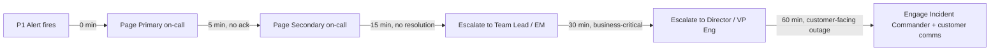

## 🎯 Learning Objectives

By the end of this chapter, you will understand:

- Cultural changes required for successful SysOps Framework adoption
- How to build sustainable operational cultures focused on reliability
- Strategies for managing organizational resistance and change
- Leadership approaches that support operations team transformation

> **Principles in play.** Culture is where _Knowledge Sharing_ either lives or dies, and where _Continuous Availability_ ([Chapter 2](chapter-02-principles.md)) is kept humane — sustainable on-call instead of slow-motion burnout.

## 🌱 Building an Operations-Focused Culture

### The Cultural Challenge

Traditional organizational cultures often prioritize speed of delivery over operational stability, creating tension for operations teams trying to implement the SysOps Framework. Success requires deliberate cultural transformation that values reliability, continuous improvement, and sustainable practices alongside innovation and growth.

### Core Cultural Values for Operations Excellence

| Value                                       | Traditional View                                           | Operations View                                                         | How to Balance                                                           | How to Implement                                                      |
| ------------------------------------------- | ---------------------------------------------------------- | ----------------------------------------------------------------------- | ------------------------------------------------------------------------ | --------------------------------------------------------------------- |
| Reliability over speed                      | "Move fast and break things"                               | "Move thoughtfully and fix things before they break"                    | Speed through automation and process optimization, not through shortcuts | Reward teams for preventing problems, not just solving them quickly   |
| Continuous learning over blame              | Find who caused the problem and prevent it happening again | Understand why the system allowed the problem and strengthen the system | Individual accountability within blameless system improvement            | Post-incident reviews focus on process and system improvements        |
| Proactive prevention over reactive response | React quickly when things go wrong                         | Invest in preventing things from going wrong                            | Excellence in both prevention and response capabilities                  | Allocate time and resources for preventive work                       |
| Team resilience over individual heroes      | Rely on expert individuals to solve critical problems      | Build team capabilities that don't depend on specific individuals       | Value expertise while ensuring knowledge sharing and cross-training      | Reward knowledge sharing and mentoring alongside individual expertise |

> Every team has a Dave. Dave is brilliant, Dave knows where all the bodies are buried, and Dave is the only person who understands the billing batch job — which is fine right up until Dave goes on holiday to a place without signal and the batch job decides that's the week to misbehave. The hero culture feels great until the hero is unreachable. The goal isn't to get rid of Dave; it's to make sure the team survives Dave's well-deserved week off. (Dave, incidentally, also deserves to take a holiday without his phone.)
>
> **A critical nuance**: anti-hero culture is not anti-expertise. The goal is not to flatten expertise or pretend everyone is interchangeable — it's to ensure that expertise is _shared_ rather than hoarded. Dave's deep knowledge of the billing batch job is valuable and should be recognised, compensated, and celebrated. What should not be celebrated is a team structure where only Dave can fix the billing batch job. The two things look similar from the outside but are opposites: one rewards expertise _and_ resilience; the other rewards expertise _instead of_ resilience. Pay your experts well, celebrate their depth, and also hold them accountable for documenting, mentoring, and ultimately making themselves non-critical.

## 🏢 Organizational Structure and Support

### Leadership Alignment

**Executive Understanding**
Operations work is fundamentally different from project work, requiring different success metrics, resource allocation, and timeline expectations. Leadership must understand that:

- **Interruptions are normal**, not failures of planning
- **Prevention work is valuable**, even when its success is invisible
- **Operational expertise takes time to develop** and should be retained and nurtured
- **Infrastructure investment pays dividends** through reduced operational overhead

**Middle Management Support**
Middle managers often face the greatest pressure to balance operational needs with project demands. They need:

- **Clear escalation authority** for operational decisions
- **Understanding of operational metrics** and how to interpret them
- **Support for saying "no"** to requests that compromise reliability
- **Resources for team development** and continuous improvement

### Cross-Functional Relationships

| Relationship                    | Practice                      | What It Looks Like                                                                 |
| ------------------------------- | ----------------------------- | ---------------------------------------------------------------------------------- |
| Development team collaboration  | Shared responsibility         | Both teams share accountability for service reliability                            |
| Development team collaboration  | Early involvement             | Operations teams involved in design and architecture decisions                     |
| Development team collaboration  | Feedback loops                | Regular communication about operational impact of changes                          |
| Development team collaboration  | Joint planning                | Coordinated approach to capacity, security, and reliability planning               |
| Security team integration       | Security as code              | Security requirements built into operational processes                             |
| Security team integration       | Shared tooling                | Common platforms for monitoring and incident response                              |
| Security team integration       | Risk assessment               | Joint evaluation of security and operational risks                                 |
| Security team integration       | Compliance coordination       | Integrated approach to regulatory and audit requirements                           |
| Business stakeholder engagement | Service level agreements      | Clear, measurable commitments that balance business needs with operational reality |
| Business stakeholder engagement | Business impact communication | Translate technical issues into business language                                  |
| Business stakeholder engagement | Change communication          | Proactive communication about planned changes and their impact                     |
| Business stakeholder engagement | Value demonstration           | Regular reporting on operational contributions to business success                 |

### Role-Responsibility Mapping

Every ops team has a set of distinct hats that don't always match job titles. This table maps common roles to their primary responsibilities within the framework's cycles and practices. Use it to clarify who owns what — before a gap or overlap becomes a problem.

| Role                                       | Primary Accountability                                                                                                            | Which Cycle They Own                                    | Key Practices They Drive                                                           | Typical Decisions                                                                                                      |
| ------------------------------------------ | --------------------------------------------------------------------------------------------------------------------------------- | ------------------------------------------------------- | ---------------------------------------------------------------------------------- | ---------------------------------------------------------------------------------------------------------------------- |
| **Principal Engineer**                     | Technical vision and architecture decisions that affect reliability, cost, and scalability                                        | Monthly Strategy — sets technical direction             | Capacity & Performance (4), Financial Management (11)                              | "Which cloud region should we expand to?" "Monolith or microservices?" "When do we migrate off this vendor?"           |
| **Architect**                              | System design, integration patterns, technology selection within the vision                                                       | Monthly Strategy — reviews and proposes                 | Change & Configuration (3), Release Management (8), Asset Management (9)           | "Which monitoring stack fits our topology?" "How do we design for multi-region failover?" "What's the migration path?" |
| **Team Leader (Functional & Operational)** | People management, prioritisation, stakeholder communication, removing blockers                                                   | Weekly Improvement — runs the retro and priority review | Team & Skill Development (6), Knowledge & Documentation (5), Vendor & Contract (7) | "Who is on-call next week?" "What improvement do we fund this quarter?" "Can the team absorb this new service?"        |
| **Platform Manager**                       | Infrastructure platform health, cost control, vendor relationships, SLO negotiation                                               | Daily Operations — owns the dashboard and alert triage  | Service Level Management (1), Financial Management (11), Vendor & Contract (7)     | "Do we accept this SLO?" "Is the platform bill within budget?" "Which alert gets a runbook?"                           |
| **Service Owner**                          | Day-to-day health of a specific service (e.g., Azure, Kubernetes, a database cluster); first responder for incidents affecting it | Daily Operations — incident response participant        | Incident & Problem (2), Backup & Recovery (12), Capacity & Performance (4)         | "Is this alert worth paging over?" "Do I roll back or fix forward?" "When does this service need more capacity?"       |
| **On-Call Engineer**                       | Rotating responsibility for incident response during assigned shifts (where 24/7 rotation applies)                                | Daily Operations — shift execution                      | Incident & Problem (2), Knowledge & Documentation (5)                             | "Is this a P1 or P2?" "Do we need to wake up the Service Owner?" "Is the runbook correct?"                             |
| **Incident Commander (ICS)**               | Coordination during major incidents — does NOT debug, keeps the response organised                                                | Daily Operations — activated per incident               | Incident & Problem (2)                                                             | "Who is on the bridge?" "Do we escalate to the director?" "What do we tell customers?"                                 |
| **SRE / Ops Engineer**                     | Automation, monitoring reliability, reducing toil across the platform                                                             | Weekly Improvement — implements automation projects     | Release Management (8), Service Request (10), Change & Configuration (3)           | "Which manual step do I automate next?" "Is this change safe to standardise?"                                          |

> **Roles are not people.** One person may wear multiple hats (especially in small teams). The Principal Engineer may also be the Team Leader. The point of the table is to make sure _every hat has a head_ — not to prescribe headcount. If a responsibility has no owner, it will be neglected; if two people think they own it, you have a future conflict. Use this table to check: for each practice in Chapter 6, can you name who drives it?

**How roles map to the three operational cycles**:

| Cycle                          | Who Leads                                                          | Who Participates                                             |
| ------------------------------ | ------------------------------------------------------------------ | ------------------------------------------------------------ |
| **Daily** (15-min ops review)  | Platform Manager or senior engineer rotates as facilitator       | All Service Owners, on-call engineer (where rotation exists) |
| **Weekly** (improvement retro) | Team Leader                                                        | Principal Engineer, Platform Manager, rotating Service Owner |
| **Monthly** (strategy)         | Principal Engineer or Team Leader                                  | Architect, Platform Manager, invited Service Owners          |

## 🔄 Change Management Strategies

### Overcoming Resistance to Framework Adoption

**Common Sources of Resistance**:

1. **"We've always done it this way"** - Comfort with existing processes
2. **"We don't have time for this"** - Pressure from immediate operational needs
3. **"This won't work in our environment"** - Skepticism about framework applicability
4. **"Management won't support it"** - Perceived lack of organizational backing

### Change Management Approach

**Phase 1: Building Awareness (Weeks 1-4)**

- Educate team and stakeholders about problems with current approaches
- Share success stories from other organizations
- Demonstrate small wins and quick improvements
- Address concerns and misconceptions directly

**Phase 2: Creating Desire (Weeks 5-8)**

- Show concrete benefits of framework adoption
- Involve team members in framework design and customization
- Address individual concerns and motivations
- Build coalition of framework champions

**Phase 3: Developing Knowledge (Weeks 9-16)**

- Provide comprehensive training on framework concepts and practices
- Offer hands-on experience with new tools and processes
- Create opportunities for peer learning and knowledge sharing
- Establish mentoring relationships with experienced practitioners

**Phase 4: Building Ability (Weeks 17-24)**

- Support team members as they apply new skills and knowledge
- Provide coaching and feedback during implementation
- Remove barriers and obstacles to framework adoption
- Celebrate successes and learn from challenges

**Phase 5: Reinforcing Change (Ongoing)**

- Align performance evaluation and rewards with new practices
- Continue to refine and improve framework implementation
- Share success stories and lessons learned
- Maintain momentum through continuous improvement

### 🎮 Interactive Exercise: Change Readiness Assessment

**Scenario**: You're implementing the SysOps Framework in a traditional IT operations team. Current characteristics:

- 8-person team with average 5 years experience
- High stress environment with frequent firefighting
- Limited documentation and knowledge sharing
- Skeptical management focused on cost reduction
- Recent history of failed improvement initiatives

**Assessment Questions**:

1. What are the main sources of resistance you'd expect?
2. Which team members would likely be early adopters vs. late adopters?
3. What would be your first three change management priorities?
4. How would you build credibility and momentum for the framework?

**Framework Response Strategy**:

1. **Resistance Sources**: Skepticism from past failures, time pressure, management pressure
2. **Adoption Patterns**: Identify natural problem-solvers as champions, address skeptics individually
3. **Priorities**: Quick wins to build credibility, stress reduction through better processes, management education
4. **Momentum Building**: Start with daily operations improvements, measure and communicate success, gradually expand scope

## 👥 Team Development and Growth

### Building Operational Expertise

| Skill Area  | Capability                  | Focus                                                                  |
| ----------- | --------------------------- | ---------------------------------------------------------------------- |
| Technical   | Systems thinking            | Understanding complex system interactions and dependencies             |
| Technical   | Troubleshooting methodology | Systematic approaches to problem diagnosis and resolution              |
| Technical   | Automation skills           | Scripting, infrastructure as code, and process automation capabilities |
| Technical   | Security awareness          | Understanding security implications of operational decisions           |
| Operational | Incident response           | Coordinated response to service disruptions and emergencies            |
| Operational | Communication               | Clear, concise communication during stressful situations               |
| Operational | Risk assessment             | Evaluating and managing operational risks                              |
| Operational | Process improvement         | Identifying and implementing operational enhancements                  |
| Leadership  | Decision making             | Making sound decisions under pressure with incomplete information      |
| Leadership  | Mentoring                   | Developing and supporting team members                                 |
| Leadership  | Stakeholder management      | Building relationships and managing expectations                       |
| Leadership  | Strategic thinking          | Connecting operational work to business objectives                     |

### Career Development Paths

**Technical Specialist Track**

- **Deep Expertise**: Develop specialized knowledge in specific technologies or domains
- **Architecture Influence**: Contribute to system design and technology selection decisions
- **Innovation Leadership**: Drive adoption of new technologies and approaches
- **External Recognition**: Speaking, writing, and community participation

**Operations Leader Track**

- **Team Management**: Leading and developing operations teams
- **Process Excellence**: Designing and implementing operational processes at scale
- **Strategic Planning**: Contributing to organizational technology and operations strategy
- **Cross-Functional Leadership**: Leading initiatives that span multiple teams and departments

**Cross-Functional Track**

- **DevOps Engineering**: Bridging development and operations responsibilities
- **Site Reliability Engineering**: Applying software engineering practices to operations challenges
- **Platform Engineering**: Building internal platforms and tools for other teams
- **Product Management**: Managing infrastructure and operations capabilities as internal products

#### Career Ladder Example: Ops Engineer

The most useful career ladder is one that tells an engineer exactly what "the next level looks like" in terms of observable behaviour, not years served. Below is a concrete ladder for an operations track. Adapt the level names and scope to match your organisation's existing structure.

| Level | Title                  | Scope                            | Key Signals                                                                                                                                                                   | Promotion Criteria                                                                                                             |
| ----- | ---------------------- | -------------------------------- | ----------------------------------------------------------------------------------------------------------------------------------------------------------------------------- | ------------------------------------------------------------------------------------------------------------------------------ |
| L1    | Associate Ops Engineer | Single systems, supervised       | Follows runbooks correctly; escalates when stuck; documents what they learned                                                                                                 | Consistently handles tier-2 systems without supervision                                                                        |
| L2    | Ops Engineer           | Multiple systems, independent    | Participates in on-call rotation where applicable; contributes runbook improvements; identifies repetitive manual work                                                          | Led at least one process improvement; on-call health metrics green (where rotation exists)                                   |
| L3    | Senior Ops Engineer    | Critical systems, mentors others | Designs runbooks for new systems; mentors L1/L2 engineers; leads incident response as IC; drives automation projects                                                          | Two+ automation projects deployed; mentored 2 juniors through their first on-call rotation (if team runs one)                   |
| L4    | Staff Ops Engineer     | Cross-team, architectural        | Defines operational standards adopted by multiple teams; designs DR plans; influences platform architecture; publishes post-incident analyses that change team practice       | Standards adopted by 2+ teams; DR plan tested to target RTO; recognised as subject-matter expert in at least one domain        |
| L5    | Principal Ops Engineer | Organisation-wide, strategic     | Sets multi-year operational strategy; designs organisational reliability practices; represents operations in executive decision-making; published external thought leadership | Organisation-wide reliability improvements attributable to their work; external recognition (conference talk, published paper) |

> **Note.** Levels are not years. An engineer who demonstrates L3 signals at year 2 should be L3; an engineer who plateaus at L2 signals for 10 years should stay L2. Time-in-grade promotions produce titled engineers who are not ready for the scope — which is worse for team morale than no promotion at all.

### On-Call Rotation Design

**Not every team needs a 24/7 on-call rotation.** If you have fewer than five people, or your systems have enough automation and self-healing capacity to survive unattended hours, a formal on-call rotation may be more harmful than helpful. In small teams, the burden of being "always on" falls on the same few people every time, accelerating burnout and driving attrition. The alternative: invest in automated incident response, keep alert quality high enough that any overnight page is genuinely critical, and rely on a shared response pool — not a dedicated primary.

**If your team is large enough to sustain one** (typically 5+ people) and your service criticality justifies it, a well-designed rotation spreads load fairly, builds resilience, and respects engineers' personal time. The guidance below assumes you've already decided that formal on-call makes sense for your context.

#### Rotation Principles

- **Fair load distribution**: Every eligible team member participates; no individual should be on-call more than one week in four (aim for one in five or better)
- **Follow-the-sun where possible**: If your team spans time zones, distribute primary on-call so overnight hours are covered by someone for whom it is daytime — but don't invent geographic distribution just to justify 24/7 coverage
- **Shadowing before solo**: New team members shadow an experienced responder for at least two full on-call rotations before taking primary responsibility
- **On-call should not interrupt sleep more than twice per week on average**: if it does, the alert volume is a bug, not an on-call problem
- **Compensate fairly**: On-call allowances, time off in lieu, or explicit recognition — make the policy visible and consistent

#### Rotation Structures

| Structure                    | How it works                                                                                      | Best for                                       |
| ---------------------------- | ------------------------------------------------------------------------------------------------- | ---------------------------------------------- |
| **Single primary**           | One engineer on-call; pages escalate to a secondary if unanswered for 5 min                       | Small teams (3–6 people)                       |
| **Primary + secondary**      | Two engineers simultaneously; primary answers first; secondary backs up                           | Teams of 6–12                                  |
| **Squad rotation**           | Entire squad rotates (primary + secondary within the squad); other squads on escalation           | Multi-team orgs with specialised squads        |
| **Follow-the-sun**           | Primary rotates across regions by timezone; no overnight pages in anyone’s local time             | Geographically distributed teams               |
| **You build it, you run it** | Each service team owns their own on-call for their services; platform team handles infrastructure | Platform-team model with mature DevOps culture |

#### On-Call Runbook Checklist

Every on-call rotation should have a **handoff document** updated at the start of each shift containing:

1. **Active incidents or known issues** — anything the incoming responder needs to be aware of
2. **Scheduled maintenance windows** during the shift period
3. **Recent deployments** that may be unstable (link to relevant change records)
4. **Known noisy alerts** to expect and how to handle them
5. **Escalation contacts** for each service domain (database, network, vendor support)
6. **Emergency access credentials location** (secrets manager path, not the credentials themselves)

#### Alert Quality Standards

On-call fatigue is driven by low-quality alerts. Apply these standards before routing anything to a pager:

- **Every alert must be actionable**: if the engineer cannot do something meaningful in response, it is not an alert — it is a log entry
- **Every alert must have a runbook link**: the alert message includes a URL to the relevant diagnostic steps
- **Alert severity must match business impact**: use P1–P4 consistently; P1 wakes someone up, P4 goes to a ticket queue
- **Review alert fatigue monthly**: track alerts-per-shift; more than 5 actionable pages per 12-hour shift indicates a tuning problem
- **Automatically silence known-noisy alerts** during maintenance windows

#### On-Call Health Metrics

| Metric                          | Definition                                     | Target                               |
| ------------------------------- | ---------------------------------------------- | ------------------------------------ |
| Mean pages per shift            | Total pages ÷ shifts in period                 | ≤ 5 actionable pages / 12-hour shift |
| After-hours page rate           | Pages outside 09:00–18:00 local ÷ total pages  | Track trend; drive down over time    |
| On-call rotation fairness       | Std deviation of shifts per person             | < 1 shift variance across team       |
| MTTA (Mean Time to Acknowledge) | Time from page to acknowledge                  | P1 ≤ 5 min; P2 ≤ 15 min              |
| Responder burnout index         | % of responders who escalated or missed a page | 0%; any miss triggers review         |

#### Escalation Path Design

> Escalation path: P1 Alert → 0 min: Page Primary → 5 min (no ack): Page Secondary → 15 min (no resolution): Team Lead / EM → 30 min (business-critical): Director / VP Eng → 60 min (customer-facing): Incident Commander + customer comms



Document this path in the incident management runbook (Chapter 6, Practice 2) and validate it during DR simulations.

#### On-Call Policy Blueprint

Every team needs a written on-call policy — not a wiki page someone filled in once, but a living document reviewed quarterly. Below is a template you can adapt.

```yaml
policy_name: "On-Call Operations Policy"
version: 1.0
owner: "Engineering Manager, Platform Team"
review_cadence: "quarterly"

purpose: >
  Define the principles, expectations, and compensation for on-call
  rotations so that service reliability is maintained without burning
  out the engineers who maintain it.

scope:
  applies_to: "All platform and service engineers above L3"
  excludes: "Interns, probationary hires (first 3 months), known medical exceptions"
  coverage_hours: "24/7 for P1/P2; business hours only for P3/P4"

rotation:
  pattern: "Primary + secondary"
  shift_length: "7 days (Monday 09:00 → next Monday 09:00)"
  min_rest_between_shifts: "One full rotation off (7 days) after any on-call week"
  max_frequency: "One week in five (aiming for one in six)"
  handoff_time: "Monday 09:00, 30 min overlap required"

compensation:
  base: "Flat weekly on-call allowance: $X per shift week"
  incident_premium: "Additional $Y per P1 confirmed outside business hours"
  time_off_in_lieu: "Day off after any shift where > 3 pages interrupted sleep"
  alternative: "Non-monetary: one 'on-call recovery' day after shift week"

escalation:
  tier_1: "Primary on-call (0–5 min)"
  tier_2: "Secondary on-call (5–15 min no ack)"
  tier_3: "Team lead (15–30 min unresolved)"
  tier_4: "Engineering director (30+ min, customer-impacting)"
  override: "Any responder may invoke escalation at any time if out of their depth"

alert_quality:
  pager_threshold: "Only P1 and P2 page. P3 → ticket queue. P4 → log."
  max_pages_per_shift: "5 actionable pages before post-shift review required"
  runbook_requirement: "Every alerting rule MUST link to a runbook in its annotation"
  quarterly_review: "Alert inventory reviewed every quarter; silence or retire stale rules"

failure_modes:
  - scenario: "Primary misses 2 pages in one shift"
    action: "Review with manager; check for burnout, alert fatigue, or personal circumstances"
  - scenario: "Shift > 6 hours without a break during active incident"
    action: "Incident Commander MUST rotate responder out; mandatory handoff"
  - scenario: "Engineer on-call more than 1 week in 4 for 2 consecutive quarters"
    action: "Team composition review — team is understaffed for its reliability targets"
```

> **Keep it short.** The policy above is deliberately ~40 lines. An on-call policy nobody reads because it's 12 pages of legal language is an on-call policy that doesn't exist. Start here and add organisational specifics (pay bands, exact escalation contacts) without bloating the document.

## 🤝 Cross-Team Collaboration Models

### DevOps Integration

**Shared Responsibility Model**

- Development and operations teams jointly responsible for service reliability
- Shared on-call responsibilities for services
- Joint planning and decision-making for architecture and deployment approaches
- Common metrics and success criteria

**Embedded Operations Model**

- Operations engineers embedded within development teams
- Operations expertise integrated into development planning and execution
- Faster feedback loops between development decisions and operational impact
- Closer alignment between development velocity and operational stability

**Platform Team Model**

- Operations team provides self-service platforms and tools for development teams
- Development teams responsible for their own service operations using provided platforms
- Operations team focuses on platform reliability and capability development
- Clear interfaces and service level agreements between teams

### Stakeholder Communication

**Regular Communication Rhythms**

- **Daily**: Brief status updates during critical periods or incidents
- **Weekly**: Service health reports and improvement progress updates
- **Monthly**: Strategic progress reports and business value demonstration
- **Quarterly**: Comprehensive reviews and planning for upcoming priorities

**Communication Channels and Methods**

- **Executive Dashboards**: High-level metrics and trends for senior leadership
- **Service Status Pages**: Real-time status information for all stakeholders
- **Regular Reports**: Scheduled updates on operational health and improvements
- **Ad-Hoc Updates**: Timely communication about significant events or changes

## 📈 Measuring Cultural Change

### Cultural Health Indicators

**Team Engagement Metrics**

- Employee satisfaction and engagement surveys
- Retention rates and internal mobility patterns
- Participation in improvement initiatives and learning opportunities
- Peer feedback and collaboration effectiveness

**Process Adoption Metrics**

- Consistency of framework practice implementation
- Time allocation between reactive and proactive work
- Quality and frequency of documentation and knowledge sharing
- Effectiveness of cross-training and skill development programs

**Organizational Integration Metrics**

- Stakeholder satisfaction with operations team performance
- Frequency and quality of cross-team collaboration
- Leadership support and investment in operational capabilities
- Integration of operational considerations in business planning

### Cultural Transformation Timeline

**Months 1-3: Foundation Building**

- Initial resistance and skepticism normal
- Focus on quick wins and stress reduction
- Begin building new habits and practices
- Establish measurement baselines

**Months 4-6: Momentum Building**

- Increased engagement and participation
- Visible improvements in team effectiveness
- Growing stakeholder confidence
- Framework practices becoming routine

**Months 7-12: Culture Stabilization**

- New practices become "the way we work"
- Team members become framework advocates
- Continuous improvement becomes natural
- Cultural change extends beyond immediate team

**Year 2+: Culture Evolution**

- Framework principles influence broader organizational decisions
- Team becomes model for other operational groups
- Continuous adaptation and refinement of practices
- Cultural changes become self-sustaining

> **Reality check.** Culture change doesn't happen because someone printed the values on a mug or added a slide to the onboarding deck. It happens when the first person who says "no, we're not shipping that on a Friday afternoon" gets backed up instead of overruled — and when the engineer who spent a sprint on prevention work nobody noticed still gets a good review. People watch what gets rewarded, not what gets laminated.

## 🎯 Leadership Strategies for Operations Teams

### Supporting Operations Leadership

#### Practical Manager Toolkit

A set of concrete actions ops managers can take that require no budget approval and no reorganisation — just intention.

| When This Happens                                | Do This Instead of                                                                                                                                              |
| ------------------------------------------------ | --------------------------------------------------------------------------------------------------------------------------------------------------------------- |
| A P1 incident is declared                        | Stay out of the technical response. Your job is to handle stakeholder communication, clear blockers, and arrange food/caffeine for the responders.              |
| An engineer proposes automation                  | Ask "what toil will this eliminate?" and "how will we measure the time saved?" — not "how long will this take?"                                                 |
| A post-incident review identifies a systemic gap | Assign an owner and a deadline before the meeting ends. Follow up at the next weekly cycle. A finding without an owner is a complaint, not a fix.               |
| A cross-training opportunity arises              | Approve the time and explicitly protect the schedule. Cross-training is the first thing to slip when things get busy, and that's exactly when it's most needed. |
| A stakeholder demands a new service be supported | Ask three questions: what's the business justification? what's the SLO? what gets deprioritised to make room?                                                   |
| An engineer logs overtime                        | Investigate within 24 hours. Was it a genuine emergency? A preventable incident? Chronic understaffing? Overtime should trigger a question, not gratitude.      |

#### Resource Allocation

- **Time for Improvement**: Protect time for proactive work and continuous improvement
- **Tool Investment**: Provide budget for operational tools and automation capabilities
- **Training and Development**: Support ongoing skill development and certification
- **Hiring and Retention**: Competitive compensation and career development opportunities

#### Decision Support

- **Clear Authority**: Define decision-making authority for operational choices
- **Risk Tolerance**: Establish clear guidelines for acceptable operational risks
- **Change Approval**: Streamlined approval processes for operational improvements
- **Escalation Support**: Backing for operations teams when they need to say "no"

#### Performance Recognition

- **Reliability Rewards**: Recognize and reward prevention work and reliability improvements
- **Learning from Failure**: Celebrate learning and improvement from incidents and problems
- **Innovation Encouragement**: Support experimentation and innovative approaches
- **Team Development**: Recognize contributions to team capability and knowledge sharing

### Building Operations Influence

**Demonstrating Value**

- **Business Impact Metrics**: Connect operational work to business outcomes
- **Cost Avoidance**: Quantify value of problems prevented and risks mitigated
- **Efficiency Gains**: Measure and communicate productivity improvements
- **Stakeholder Satisfaction**: Track and report on internal customer satisfaction

**Strategic Participation**

- **Architecture Involvement**: Include operations perspective in system design decisions
- **Business Planning**: Participate in business planning and capacity forecasting
- **Vendor Selection**: Influence technology selection decisions based on operational requirements
- **Risk Management**: Contribute operational risk assessment to business risk management

### Performance Review Signals for Ops Engineers

Generic performance criteria ("meets expectations") are meaningless for operations work because they don't distinguish between a quiet month and a good month. Below are concrete, observable signals calibrated to each career-ladder level.

| Area                      | Weak Signal (needs improvement)                                          | Strong Signal (meets expectations)                                                      | Exemplary Signal (exceeds)                                                                                          |
| ------------------------- | ------------------------------------------------------------------------ | --------------------------------------------------------------------------------------- | ------------------------------------------------------------------------------------------------------------------- |
| **Incident response**     | Misses pages frequently; escalates without attempting triage             | Acknowledges within SLA; follows runbook; hands off smoothly after shift                | Leads incidents as IC; identifies systemic fixes after recurring incidents; runbook improvements after every shift  |
| **Documentation**         | "I'll write that up later" that never arrives                            | Updates runbook after each incident; writes handoff notes without prompting             | Identifies documentation gaps proactively; creates runbooks for undocumented systems before they fail               |
| **Cross-training**        | Is the sole operator of a critical system and has no plan to change that | Can explain at least one other person's primary system at a handoff level               | Actively trains others on their systems; their systems have bus factor ≥ 2                                          |
| **Automation**            | Performs repetitive work manually every time                             | Automates one manual task per quarter; writes reusable scripts                          | Identifies toil patterns across the team and builds shared automation; reduces team manual effort measurably        |
| **Proactive improvement** | "We'll fix it when it breaks"                                            | Submits one improvement proposal per quarter (bug fix, tool improvement, process tweak) | Drives cross-team improvement projects; quantifies impact (time saved, incidents prevented)                         |
| **Communication**         | Incident updates are vague or late                                       | Stakeholders know status without chasing; post-incident summaries are clear             | Translates technical incidents into business impact naturally; trusted by stakeholders to communicate during crises |
| **Mentoring**             | Works alone; doesn't share context                                       | Answers questions from juniors; reviews runbook PRs                                     | Rotates with juniors during on-call shadow shifts; creates training materials used by others                        |

> **What not to rate.** Hours worked, tickets closed per week, uptime of systems they don't control, or individual response time (see Chapter 7 — this metric is actively harmful). Rate contribution to team resilience, not individual heroics.

### Stakeholder Expectation Reset

The single most impactful conversation an ops manager can have is resetting what stakeholders expect from the operations team. Use this script as a starting point — adapt the numbers to your context.

**The conversation** ("Living with Ops — a frank talk for stakeholders"):

```
1. What we guarantee:
   - Our top 5 critical services will meet their SLOs 95% of the time, measured monthly.
   - P1 incidents will get a human response within 5 minutes, 24/7.
   - We will communicate status within 15 minutes of confirming a P1 incident.
   - We will conduct a blameless post-incident review within 5 business days and share findings.

2. What we do NOT guarantee (and why):
   - 100% uptime for anything. The last 0.1% costs more than the first 99.9%, and DNS,
     certificates, and upstream providers all get a vote.
   - Unlimited scope. Every new system we support means existing systems get less attention.
     New systems require a capacity review and, if needed, a headcount conversation.
   - Immediate response to non-urgent requests. Requests have SLAs (standard: 2 business days;
     expedited: 4 hours). If everything is urgent, nothing is.
   - "We'll figure it out" without a budget. Reliability has a price tag. If you want
     99.99% on a service, you need to fund the monitoring, redundancy, and staffing to deliver it.

3. What we need from you:
   - A nominated business stakeholder for each critical service who can define "what good
     looks like" in business terms.
   - 48-hour notice for planned feature releases that affect production systems
     (exceptions: security patches, which get 4-hour notice if they follow emergency change process).
   - An honest capacity forecast each quarter: "our user base is growing / flat / shrinking."
   - Backing when we say "no" — including to your own team's feature requests that
     would degrade reliability.

4. How we'll measure success (and how you'll see it):
   - Monthly one-page ops report: SLO attainment, incident summary, top 3 improvements,
     cost per service unit.
   - Quarterly business review: reliability trends, capacity outlook, major changes planned,
     investment requests and their rationale.
   - Real-time: status page for service health; Slack channel for incident updates.
```

> **Pro tip.** Send this reset in writing before the meeting. The meeting is for questions and negotiation, not for the first read. If a stakeholder pushes back on every point, that is valuable information — it tells you this person expects the ops team to absorb unlimited risk without corresponding support, and you need your own manager in the next conversation.

## 🌟 Real-World Case Studies and Cultural Models

> The following are documented, publicly verifiable industry cases, included to illustrate the cultural principles in this chapter. Each draws on the organisation's own primary-source material rather than a hypothetical scenario.

### Case Study: GitLab — Blameless Transparency After a Catastrophic Outage

On 31 January 2017, a GitLab engineer working to restore database replication accidentally ran a destructive command against the **primary** production database instead of the secondary, removing roughly 300 GB of live data. The recovery then exposed a deeper problem: of five separate backup and replication mechanisms, **none worked as intended** — `pg_dump` was silently failing due to a version mismatch, and the failure-notification emails were being rejected. The team recovered from a six-hour-old staging snapshot, permanently losing data created in that window (an estimated 5,000 projects, 5,000 comments, and 700 users), with an outage lasting roughly 18 hours ([GitLab postmortem](https://about.gitlab.com/blog/2017/02/10/postmortem-of-database-outage-of-january-31/)).

**The cultural response is what makes this a model**:

- GitLab **live-streamed the recovery** on YouTube and kept a publicly visible incident document, choosing radical transparency over reputation management.
- The CEO issued a public apology; the engineer who made the error was not punished or hidden.
- The published postmortem used a blameless **"5 Whys"** analysis that traced the incident to systemic gaps (no ownership of backup testing, undocumented runbooks, silent failure modes) rather than individual error, concluding that "an ideal environment is one in which you can make mistakes but easily and quickly recover from them."
- Concrete ownership was assigned for data durability, and backup testing was made a monitored, regular activity.

**Why it matters for SysOps**: This case demonstrates the blameless post-incident review (see [Chapter 6](chapter-06-practices.md)) and backup-and-recovery testing (Chapter 6, Practice 12) advocated throughout this framework. The lesson is cultural before it is technical: psychological safety and transparency turn even a severe failure into durable organisational learning. ([Google's SRE practice makes the same argument for blameless postmortems](https://sre.google/sre-book/postmortem-culture/).)

### Case Study: Netflix — "Reliability Enables Speed" and Chaos Engineering

As Netflix re-architected onto cloud infrastructure at global scale, it adopted a counter-intuitive cultural stance: rather than avoiding failure, teams should **deliberately and continuously inject failure** into production to build confidence that the system withstands real-world turbulence. This discipline, formalised as Chaos Engineering and popularised by tools like Chaos Monkey and the Simian Army, defines experiments that introduce real-world failure variables while minimising "blast radius" to customers ([Principles of Chaos Engineering](https://principlesofchaos.org/)).

**The cultural foundations**:

- **Shared responsibility for resilience** — reliability is everyone's concern, not a separate operations silo's burden.
- **Freedom paired with responsibility** — engineers are trusted to run experiments against production, with the explicit obligation to contain customer impact.
- **Automation as a cultural default** — experiments run continuously and automatically, reflecting an organisation that designs operations in rather than bolting them on.

**Why it matters for SysOps**: Netflix shows in practice that strong operational discipline is an _enabler_ of velocity, not a brake on it — the Principles of Chaos explicitly aim to "provide confidence to innovate quickly at massive scales." This is the same "reliability enables speed" culture the SysOps Framework seeks to build, and it connects directly to the resilience and disaster-recovery testing practices in [Chapter 10](chapter-10-risk.md).

## 🎯 Chapter Summary

Cultural transformation is often the most challenging aspect of SysOps Framework implementation, but it's also the most critical for long-term success. Organizations must deliberately build cultures that value reliability, continuous improvement, and sustainable practices while maintaining focus on innovation and business growth.

Success requires aligned leadership, effective change management, cross-functional collaboration, and sustained investment in team development. The cultural changes take time to implement and stabilize, but they create the foundation for operational excellence that enables both reliability and innovation.

## 🔮 Looking Ahead

In the next chapter, we'll explore risk management and compliance considerations, including how to implement the SysOps Framework in regulated environments and maintain operational excellence while meeting regulatory requirements.

## 💭 Reflection Questions

1. **Cultural Assessment**: How would you describe your current organizational culture regarding operations work?
2. **Change Readiness**: What would be the biggest cultural barriers to SysOps Framework adoption in your organization?
3. **Leadership Support**: What kind of leadership support would you need to drive successful cultural transformation?

---

**🎮 Gamification Element - Chapter 9 Badge**
_Complete a cultural assessment for your organization and create a change management plan to earn the "Culture Champion" badge._

---

_[← Previous: Chapter 8 - Tools & Technology](chapter-08-tools.md) | [Next: Chapter 10 - Risk & Compliance →](chapter-10-risk.md)_
