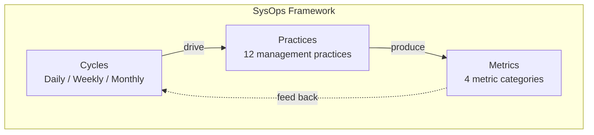
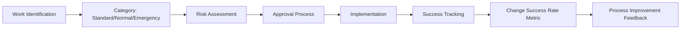
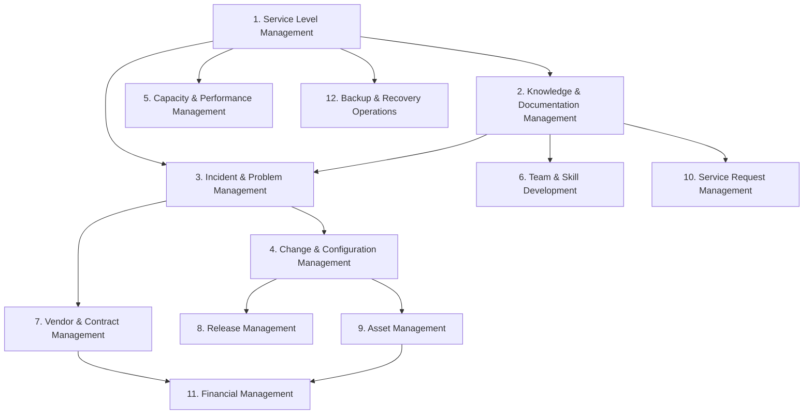
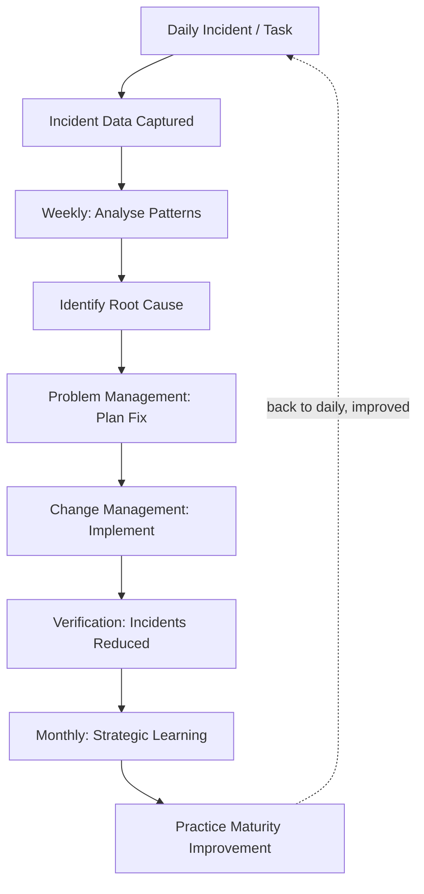
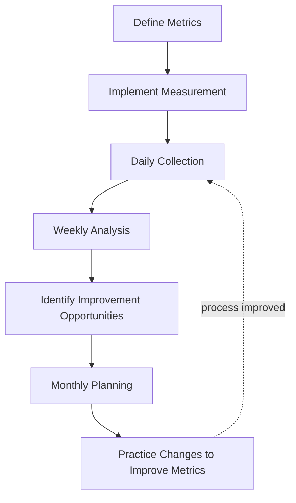

## Framework Data Relationships Map

The SysOps Framework consists of interconnected components that work together to create a cohesive operational methodology. This document explains how the different pieces relate to and support each other.

## Start by Symptom

Use this map backwards when the team is under pressure. Start with the symptom, then find the data relationships that explain it.

| Symptom            | Data to connect                                                    | Likely chapter    |
| ------------------ | ------------------------------------------------------------------ | ----------------- |
| Repeated incidents | Incident → problem → action item → owner → due date                | Chapters 6, 7, 11 |
| Change failures    | Change → service → risk → incident correlation                     | Chapters 6, 10    |
| Audit panic        | Control → evidence → artifact → review cadence                     | Chapters 10, 13   |
| Burnout            | On-call event → alert quality → rotation health → improvement work | Chapters 7, 9     |

---

## The Three Pillars: Cycles, Practices, and Metrics

The SysOps Framework rests on three pillars that continuously feed into one another: **Cycles** set the operating rhythm, **Practices** define the work done within that rhythm, and **Metrics** measure the outcomes. The metrics then feed back into the cycles, closing the loop.

> **Diagram**: Three-pillar framework structure — Cycles define rhythm, Practices define work, Metrics measure outcomes — with feedback loops between all three

**How to read it:** Cycles _drive_ which Practices run and when; Practices _produce_ the data captured as Metrics; Metrics _feed back_ into the next round of Cycles, so the framework continuously improves.

---

## Operational Cycles → Management Practices Mapping

Each management practice is applied across all three operational cycles with different emphases:

### Daily Operations Cycle (24-48h)

| Practice                                   | Daily Activities                                                | Output/Measurement            |
| ------------------------------------------ | --------------------------------------------------------------- | ----------------------------- |
| **Service Level Management**               | Monitor SLO compliance, track error budget consumption          | Daily SLI metrics, burn rate  |
| **Incident and Problem Management**        | Detect incidents, respond, restore service, document timeline   | Incident logs, response times |
| **Change and Configuration Management**    | Execute approved standard changes, update CMDB                  | Change records, CI updates    |
| **Capacity and Performance Management**    | Monitor utilisation, performance, availability                  | Real-time dashboards          |
| **Knowledge and Documentation Management** | Update runbooks during incidents, capture new knowledge         | Updated documentation         |
| **Team and Skill Development**             | On-the-job learning, peer support, skill application            | Skill progression notes       |
| **Vendor and Contract Management**         | Escalate vendor issues, monitor vendor service health           | SLA impact tracking           |
| **Release Management**                     | Monitor post-deployment health, trigger rollbacks on SLO breach | Deployment health checks      |
| **Asset Management**                       | Verify CI accuracy after incidents, update CMDB                 | Asset records                 |
| **Service Request Management**             | Fulfil standard requests, monitor same-day SLA queue            | Request fulfilment rate       |
| **Financial Management**                   | Monitor daily cloud spend, flag cost anomalies                  | Daily cost reports            |
| **Backup and Recovery Operations**         | Verify overnight backup jobs, respond to backup failures        | Backup success rate           |

### Weekly Improvement Cycle (7d)

| Practice                                   | Weekly Activities                                               | Output/Measurement    |
| ------------------------------------------ | --------------------------------------------------------------- | --------------------- |
| **Service Level Management**               | Review weekly SLO compliance, analyse trends, adjust budgets    | SLO trend analysis    |
| **Incident and Problem Management**        | Root cause analysis, identify patterns, plan preventive actions | Problem statements    |
| **Change and Configuration Management**    | Plan normal changes, schedule maintenance, risk assessment      | Change calendar       |
| **Capacity and Performance Management**    | Analyse weekly trends, identify bottlenecks                     | Capacity reports      |
| **Knowledge and Documentation Management** | Knowledge sharing sessions, documentation reviews               | Training records      |
| **Team and Skill Development**             | Cross-training, skill gap identification, mentoring             | Skills matrix updates |
| **Vendor and Contract Management**         | Weekly SLA compliance review, vendor performance metrics        | Vendor scorecards     |
| **Release Management**                     | DORA metrics review, release retrospectives, pipeline health    | DORA trend report     |
| **Asset Management**                       | CMDB reconciliation, EOL asset alerts, license utilisation      | Reconciliation report |
| **Service Request Management**             | Request queue review, SLA compliance, automation opportunities  | Fulfilment metrics    |
| **Financial Management**                   | Cloud spend vs budget review, rightsizing recommendations       | Weekly cost report    |
| **Backup and Recovery Operations**         | Review backup success rates, partial restore test results       | Restore test log      |

### Monthly Strategy Cycle (4wk)

| Practice                                   | Monthly Activities                                                   | Output/Measurement          |
| ------------------------------------------ | -------------------------------------------------------------------- | --------------------------- |
| **Service Level Management**               | Strategic SLO planning, business alignment                           | Updated SLOs, business case |
| **Change and Configuration Management**    | Major change planning, risk assessment, architecture review          | Change roadmap              |
| **Capacity and Performance Management**    | Long-term capacity planning, architecture decisions                  | Capacity forecast           |
| **Knowledge and Documentation Management** | Knowledge strategy review, tool evaluation                           | Knowledge plan              |
| **Team and Skill Development**             | Career development planning, org-wide skill strategy                 | Development plans           |
| **Vendor and Contract Management**         | Vendor business reviews, contract negotiations, strategic assessment | Contract updates            |
| **Release Management**                     | Release strategy review, pipeline investment decisions               | Release strategy doc        |
| **Asset Management**                       | Full CMDB audit, EOL planning, software license reconciliation       | Audit report                |
| **Service Request Management**             | Service catalog review, SLA target review, automation roadmap        | Catalog update              |
| **Financial Management**                   | Monthly cost report to stakeholders, budget variance analysis        | Financial report            |
| **Backup and Recovery Operations**         | Full restore test review, DR simulation planning                     | DR readiness report         |

### Practice-to-Cycle Dependency Map

> **Diagram**: All 12 practices mapped to Daily, Weekly, and Monthly cycles showing which practice lives in which cycle

---

## Metrics Framework → Practices Mapping

Each metric category is supported by specific management practices:

### Service Reliability Metrics

**Primary Supporting Practices:**

1. **Service Level Management** - Defines what SLIs and SLOs to measure
2. **Incident and Problem Management** - Responds to reliability issues, prevents recurrence
3. **Backup and Recovery Operations** - Ensures data can be restored within RTO/RPO

**Key Metrics:**

- Availability/Uptime
- Mean Time to Recovery (MTTR)
- Mean Time Between Failures (MTBF)
- SLO Compliance %
- Error Budget Burn Rate
- RTO/RPO Achievement Rate

### Operational Efficiency Metrics

**Primary Supporting Practices:**

1. **Change and Configuration Management** - Change success rate, CMDB accuracy
2. **Capacity and Performance Management** - Resource utilisation
3. **Release Management** - Deployment frequency, lead time, change failure rate
4. **Service Request Management** - Fulfilment time, automation rate

**Key Metrics:**

- Automation Coverage %
- Incident Response Time
- Change Success Rate
- Capacity Utilisation %
- Deployment Frequency (DORA)
- Mean Lead Time for Changes (DORA)
- Request Fulfilment Rate
- First-Fix Resolution %

### Team Performance Metrics

**Primary Supporting Practices:**

1. **Team and Skill Development** - Cross-training, skills growth
2. **Knowledge and Documentation Management** - Documentation coverage, knowledge transfer

**Key Metrics:**

- Knowledge Transfer Rate
- Cross-Training Completion %
- On-Call Rotation Health (after-hours incidents per rotation)
- Problem Resolution Time
- Documentation Coverage %
- Team Satisfaction Score

### Business Value Metrics

**Primary Supporting Practices:**

1. **Vendor and Contract Management** - Vendor SLA compliance, cost optimisation
2. **Asset Management** - Asset lifecycle cost, license compliance
3. **Financial Management** - Budget accuracy, chargeback/showback adoption

**Key Metrics:**

- Customer Satisfaction Score
- Business Service Availability
- Cost Per Service Unit
- Cloud Cost Allocation Accuracy
- Vendor SLA Achievement %
- Budget Variance %

## Practice Data Flows

### Service Level Management Data Flow

> **Diagram**: Data flow from customer requirements through SLI/SLO definition, monitoring, error budget tracking, to business value reporting

### Incident and Problem Management Data Flow

> **Diagram**: Incident flow from alert/detection through triage, resolution, post-incident review, to problem management and knowledge base updates

### Change and Configuration Management Data Flow

> **Diagram**: Change flow from work identification through categorisation, risk assessment, approval, implementation, to CMDB update

---

## Cross-Practice Dependencies

### Service Level Management depends on:

- **Knowledge and Documentation Management**: Documentation of SLO targets and procedures
- **Incident and Problem Management**: Fast incident response preserves SLOs
- **Change and Configuration Management**: Controlled changes that impact SLOs

### Incident and Problem Management depends on:

- **Knowledge and Documentation Management**: Runbooks guide incident response
- **Service Level Management**: SLOs inform incident severity classification
- **Team and Skill Development**: Team skills impact resolution speed

### Change and Configuration Management depends on:

- **Service Level Management**: SLOs inform change risk assessment
- **Capacity and Performance Management**: Capacity data impacts change risk
- **Knowledge and Documentation Management**: Runbooks guide change execution

### Release Management depends on:

- **Change and Configuration Management**: Release gates integrate with change control
- **Service Level Management**: Error budgets determine release go/no-go
- **Incident and Problem Management**: Post-release incidents trigger rollback

### Vendor and Contract Management depends on:

- **Service Level Management**: Vendor SLAs align with internal SLOs
- **Knowledge and Documentation Management**: Vendor documentation and escalation procedures
- **Financial Management**: Contract costs impact budget planning

### Financial Management depends on:

- **Asset Management**: Asset inventory informs depreciation and licensing costs
- **Vendor and Contract Management**: Vendor costs are the largest operational expense
- **Capacity and Performance Management**: Capacity decisions drive infrastructure spending

### Backup and Recovery Operations depends on:

- **Service Level Management**: RTO/RPO targets are derived from SLOs
- **Knowledge and Documentation Management**: Recovery runbooks must be current and tested
- **Change and Configuration Management**: CMDB data identifies what needs backup

---

## Maturity Model Integration

The practice maturity model (Chapter 6) shows how practices evolve through five levels:

| Level          | Characteristics                    | Data/Metrics Implication                   |
| -------------- | ---------------------------------- | ------------------------------------------ |
| 1 - Initial    | Ad hoc, reactive                   | No formal metrics, anecdotal reporting     |
| 2 - Repeatable | Defined procedures, basic tracking | Basic metrics collected, inconsistent      |
| 3 - Defined    | Standardised practices, integrated | Consistent metrics, trend visibility       |
| 4 - Managed    | Measured, continuously improved    | Detailed metrics, cause-effect analysis    |
| 5 - Optimising | Continuously evolving, innovative  | Predictive metrics, proactive optimisation |

**Each practice progresses independently:** You might have Incident Management at Level 3, Change Management at Level 2, and Service Level Management at Level 4.

The [Getting Started guide](getting-started/) maps these maturity levels to implementation timeframes: expect practices at Level 1-2 after the 30-day pilot, Level 3 by Month 4, and Level 4+ by Month 6 of full rollout.

---

## Key Implementation Dependencies

> **Diagram**: Practice dependency graph showing which practices depend on others — e.g., SLO Management depends on Knowledge Management, Incident Management depends on SLO Management

**Critical path for implementation:**

1. **Service Level Management** — defines what success looks like, informs all other practice targets
2. **Knowledge and Documentation Management** — enables repeatable execution, foundation for incident response
3. **Incident and Problem Management** — enables daily operations, provides feedback to improve other practices
4. **Change and Configuration Management** — enables controlled improvement, uses incident feedback
5. **Capacity and Performance Management** — strategic foundation for growth planning
6. **Team and Skill Development** — sustainable growth through skilled team
7. **Vendor and Contract Management** — manages external dependencies at scale
8. **Release Management** — governed delivery pipeline, integrates with change control
9. **Asset Management** — tracking what you own, license compliance
10. **Service Request Management** — separating requests from incidents
11. **Financial Management** — cost visibility and accountability
12. **Backup and Recovery Operations** — last line of defence

---

## Feedback Loops

### The Continuous Improvement Cycle

> **Diagram**: Continuous improvement loop — daily incidents captured → weekly improvement → monthly strategy → prioritised improvements feed back into daily operations

### The Metric-Driven Cycle

> **Diagram**: Metric-driven cycle — define metrics → implement measurement → collect data → analyse trends → adjust targets → repeat

---

## Common Questions About Relationships

**Q: How does changing a practice affect metrics?**

A: Changes to a practice typically require 1-3 months to show measurable improvement in metrics. For example, improving change management procedures may show reduced MTBF after 4-6 weeks of accumulated data.

**Q: Which practice should we improve first?**

A: Start with **Service Level Management** (defines success) and **Knowledge and Documentation Management** (enables execution). Then address bottlenecks identified by metrics — typically Incident and Problem Management or Change and Configuration Management. Build maturity in parallel rather than sequentially.

**Q: How do we measure if we are making progress?**

A: Three ways:

1. **Practice Maturity** — complete maturity assessment questions (Chapter 6) for each of the 12 practices
2. **Metric Trends** — track leading indicators (automation coverage, documentation %) and lagging indicators (MTTR, SLO compliance)
3. **Cycle Alignment** — verify practices are integrated into all three cycles with regular execution

**Q: What happens if we implement cycles without practices?**

A: Cycles without practices lead to "process theatre" — meetings and activities without clear purpose. Practices define _what_ happens in each cycle. Both are essential.
