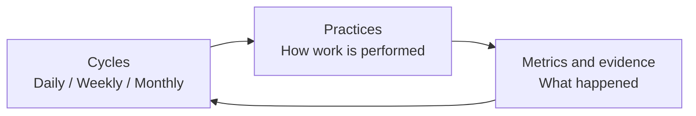
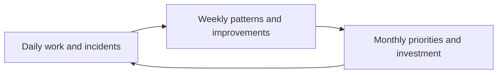

## Read the Framework as a Loop

The framework has three moving parts:

1. **Cycles** decide when work receives attention.
2. **Practices** define how the work is performed.
3. **Metrics and evidence** show whether it worked.

> **Diagram:** Cycles schedule the practices; practices produce evidence; evidence changes the next cycle.

```mermaid
flowchart LR
    C[Cycles<br/>Daily / Weekly / Monthly] --> P[Practices<br/>How work is performed]
    P --> M[Metrics and evidence<br/>What happened]
    M --> C
```

## Practice Map

This is a navigation aid, not a second definition of the practices. Detailed guidance lives in [Chapter 6](chapter-06-practices.md); metrics live in [Chapter 7](chapter-07-metrics.md).

| Practice                               | Daily                                | Weekly                            | Monthly                        | Primary evidence                     |
| -------------------------------------- | ------------------------------------ | --------------------------------- | ------------------------------ | ------------------------------------ |
| Service Level Management               | Watch SLOs and error budgets         | Review trends                     | Revisit targets                | SLI history, SLO decisions           |
| Incident and Problem Management        | Restore service and capture events   | Analyze recurring causes          | Fund systemic fixes            | Incident timeline, action items      |
| Change and Configuration Management    | Execute approved changes             | Review failures and schedule work | Assess major changes           | Change record, configuration history |
| Capacity and Performance Management    | Watch saturation and latency         | Analyze trends                    | Forecast demand                | Capacity and performance reports     |
| Knowledge and Documentation Management | Correct runbooks while using them    | Review gaps and share knowledge   | Set documentation priorities   | Runbooks, ownership records          |
| Team and Skill Development             | Pair and hand off work               | Cross-train                       | Review capability gaps         | Skills matrix, training outcomes     |
| Vendor and Contract Management         | Escalate service failures            | Review vendor performance         | Review contracts and risk      | SLA results, vendor decisions        |
| Release Management                     | Watch deployments and roll back      | Review delivery performance       | Improve release policy         | Deployment records, release metrics  |
| Asset Management                       | Correct ownership and inventory data | Reconcile changes                 | Review lifecycle risk          | Asset inventory, lifecycle decisions |
| Service Request Management             | Fulfill standard requests            | Improve or automate the queue     | Review the catalog             | Request history, catalog changes     |
| Financial Management                   | Flag anomalies                       | Review cost trends                | Forecast and allocate spending | Cost reports, budget decisions       |
| Backup and Recovery Operations         | Verify jobs and handle failures      | Test restores                     | Exercise recovery plans        | Backup results, restore evidence     |

Not every practice needs a separate meeting in every cycle. Combine reviews when the same people, evidence, and decision are involved.

## Start with the Symptom

| Symptom            | Connect these records                                   | Where to continue     |
| ------------------ | ------------------------------------------------------- | --------------------- |
| Repeated incidents | Incident → cause → action → owner → due date            | Chapters 6, 7, and 11 |
| Failed changes     | Change → deployment → service metric → incident         | Chapters 6 and 10     |
| Audit panic        | Control → required evidence → artifact → reviewer       | Chapters 10 and 13    |
| Burnout            | Page → alert quality → rotation load → improvement work | Chapters 7 and 9      |
| Unexplained cost   | Asset → service → owner → vendor or cloud charge        | Chapters 6, 7, and 12 |
| Slow recovery      | Service → dependency → runbook → restore test           | Chapters 6 and 10     |

## Dependencies That Matter

Most practices can improve independently. Start with the dependency that blocks real work:

- Service levels need measurable services and named owners.
- Incident response needs trusted alerts, escalation, and usable runbooks.
- Change and release management need service ownership and rollback evidence.
- Capacity planning needs consistent telemetry and demand context.
- Asset, vendor, and financial management need shared identifiers.
- Recovery needs explicit RTO/RPO targets and tested procedures.

Avoid turning this into a fixed implementation sequence. A team with failing backups should not postpone recovery work because its service catalog is incomplete.

## The Feedback Loop

> **Diagram:** Daily evidence exposes recurring work; weekly review improves it; monthly decisions fund larger changes.

```mermaid
flowchart LR
    D[Daily work and incidents] --> W[Weekly patterns and improvements]
    W --> M[Monthly priorities and investment]
    M --> D
```

If a cycle produces meetings but no evidence, decision, or changed behavior, remove or redesign it. That is process theater, not framework adoption.

---

_[← Previous: Glossary](glossary.md) | [Back to Book Overview →](_index.md)_
