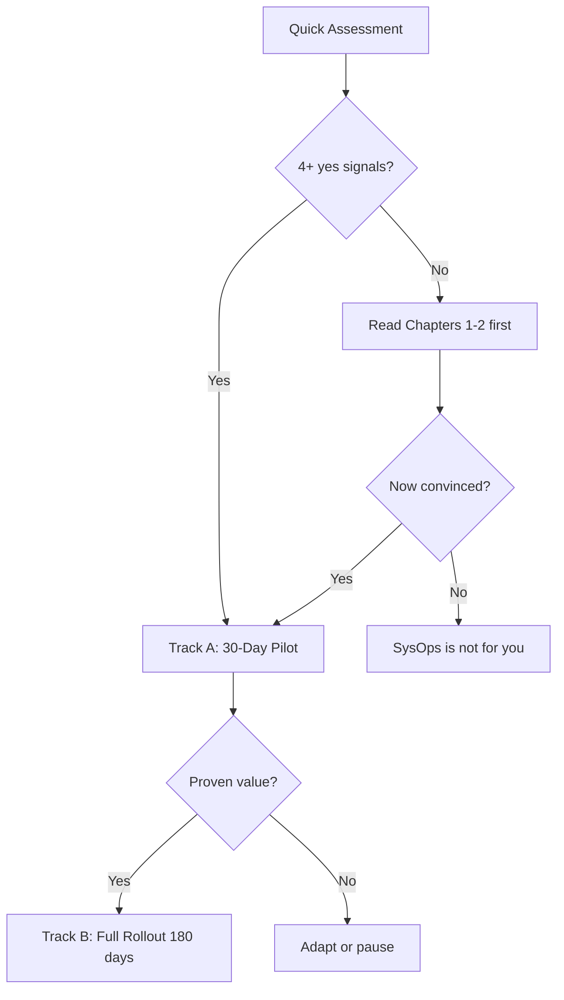

{}
The SysOps Framework works best when you start small, prove the model, then expand. This guide gives you two tracks: a **30-day pilot** for a single team, and a **180-day full rollout** if you already know this is for you.
{}

## Quick Assessment: Is Your Team Ready?

Answer yes/no to each signal, not aspiration:

| Signal                                                                            | Yes | No  |
| --------------------------------------------------------------------------------- | --- | --- |
| Your team spends more time firefighting than improving                            | ☐   | ☐   |
| Sprint commitments get disrupted by operational emergencies at least once a month | ☐   | ☐   |
| You have basic monitoring and incident tracking in place                          | ☐   | ☐   |
| At least one person on the team is willing to try a different approach            | ☐   | ☐   |
| Your manager knows operations work doesn't fit sprints                            | ☐   | ☐   |
| You can protect 20% of team time for improvements                                 | ☐   | ☐   |

**4+ "Yes"** → You are ready to pilot. Start the **[30-day pilot track](#track-a-30-day-pilot)**.

**2-3 "Yes"** → You can pilot but will hit readiness gaps. Read the **[Readiness Gaps section](#readiness-gaps-that-block-rollout)** first, then start the pilot.

**0-1 "Yes"** → Start by reading [Chapter 1](../chapter-01-challenge/) and [Chapter 2](../chapter-02-principles/). Your team needs to feel the problem before the solution will stick.

## Manager Brief: What You Are Approving

A SysOps pilot is not a process rebrand. You are approving three practical changes:

1. **Interrupt work becomes visible** instead of being hidden inside failed sprint commitments.
2. **Improvement work gets protected capacity** instead of being postponed whenever operations gets busy.
3. **Stakeholder reporting changes** from activity lists to service health, risk, toil, and completed improvements.

The pilot should be judged by whether it reduces confusion and improves operational learning, not by whether the team appears busier.

## Choose Your Adoption Path

> **Diagram**: Adoption decision tree — quick assessment → pilot (30-day) or read first → full rollout (180-day) or adapt

---

## Track A: 30-Day Pilot

Run this in one team. Do not attempt to roll out to multiple teams until the pilot proves value.

### Week 1 — Baseline

**Goal**: Know where you stand before you change anything.

- [ ] Document every incident and interruption for 5 days. Use a simple log — no fancy tools needed.
- [ ] Measure: how much time goes to reactive vs proactive work?
- [ ] Read [Chapter 1](../chapter-01-challenge/) and [Chapter 2](../chapter-02-principles/). Discuss with the team: "Do we see ourselves here?"
- [ ] Establish three baseline metrics: incident frequency, MTTR (if you can calculate it), and a rough team satisfaction score (1-10 survey).

**Artifact**: `baseline-metrics.csv` — the simplest spreadsheet with daily counts. You will compare against this in week 4.

### Week 2 — Daily Cycle

**Goal**: The daily operations cycle is running.

- [ ] Implement Monitor → Respond → Document → Review as a lightweight cycle.
- [ ] Replace the daily standup with a **standalone**: "Is anything on fire? Does anyone need help?" (5 minutes max).
- [ ] Log every incident with a timestamp, a summary, and the resolution.
- [ ] End each day with a 5-minute review: "What pattern did we see today?"

**Artifact**: Incident log with at least 5 entries. A shared document or wiki page is fine.

### Week 3 — First Improvement

**Goal**: Prove the weekly cycle works by completing one improvement.

- [ ] From the incident log, pick the most painful recurring issue.
- [ ] Allocate 4 hours this week to fix or reduce it. This is non-negotiable time — protect it.
- [ ] Execute the fix. Document what you did.
- [ ] Measure: did the fix reduce the frequency or impact of the issue?

**Artifact**: A completed improvement documented in one paragraph: what was the problem, what did you do, what changed.

### Week 4 — Review and Decide

**Goal**: Evaluate the pilot and decide whether to continue.

- [ ] Compare incident frequency and MTTR against baseline.
- [ ] Survey the team: "Is the daily cycle helping? What is worse?"
- [ ] Write a one-page pilot retrospective covering: what worked, what didn't, what to change.
- [ ] Decide: **Go** (start full rollout), **Adapt** (adjust cycles and re-run pilot), or **Stop** (SysOps is not a fit).

**Artifact**: `pilot-retrospective.md` — one page, three sections: what worked, what didn't, what we would change.

### Sample Weekly Calendar (Pilot)

| Day       | Daily Cycle                                 | Improvement Time            |
| --------- | ------------------------------------------- | --------------------------- |
| Monday    | Standalone + review weekend incidents       | 2h — plan first improvement |
| Tuesday   | Standalone + monitoring review              | —                           |
| Wednesday | Standalone + mid-week check                 | 2h — execute improvement    |
| Thursday  | Standalone + knowledge share                | —                           |
| Friday    | Standalone + weekly review + metrics update | —                           |

---

## Track B: Full Rollout (180 Days)

Only start this once the 30-day pilot shows clear value. Do not skip the pilot.

### Months 1-2 — Foundation

- All three cycles running (daily, weekly, monthly)
- Read [Chapter 5](../chapter-05-implementation/) and build your rollout plan
- Identify your **practice starting point**: pick 3 practices from [Chapter 6](../chapter-06-practices/) that address your biggest pain points
- Set up a basic metrics dashboard (see [Chapter 7](../chapter-07-metrics/))
- Begin stakeholder reporting: send a monthly one-page status update

**Artifact**: `stakeholder-update.md` — single page with three numbers (incidents, improvements completed, MTTR trend) and one ask.

### Months 3-4 — Integration

- All 12 practices assessed for maturity (use the maturity model in Chapter 6)
- Weekly improvement cycle producing measurable results
- Monthly strategy cycle has completed at least one strategic initiative
- Cross-training and knowledge sharing are happening (not planned — happening)
- On-call rotation includes the framework's handoff and escalation patterns (see [Chapter 9](../chapter-09-culture/))

### Months 5-6 — Maturity

- All cycles running without active management attention
- Automation coverage trending up, toil trending down
- Framework metrics integrated into team and stakeholder reporting
- Team can articulate what the framework does for them without referring to the book

---

## Stop Conditions

Pause or roll back the rollout if any of these conditions appear:

| Stop condition                                                       | Why it matters                                          | What to do instead                                                 |
| -------------------------------------------------------------------- | ------------------------------------------------------- | ------------------------------------------------------------------ |
| Daily cycle becomes a second status meeting                          | The framework is adding ceremony without improving flow | Replace the meeting with a visible queue and short triage          |
| Weekly improvement work is never protected                           | The team is still in firefighting mode                  | Reduce scope and run daily-only mode for 2–4 more weeks            |
| Stakeholders still demand sprint-style commitments for reactive work | The operating model has not been understood             | Run a stakeholder reset using Chapter 4 language                   |
| Metrics are used to blame individuals                                | Measurement will destroy trust                          | Stop metric reporting until ownership and interpretation are clear |

A stopped pilot is not failure. It is evidence that the team needs a smaller adoption mode or stronger sponsorship.

## Readiness Gaps That Block Rollout

If you scored 2-3 "Yes" on the assessment, address these before or during the pilot:

| Gap                                | What to do                                                                                                                                                                           |
| ---------------------------------- | ------------------------------------------------------------------------------------------------------------------------------------------------------------------------------------ |
| No monitoring or incident tracking | Set up basic monitoring (Prometheus + AlertManager or equivalent) and a shared incident log before week 1                                                                            |
| No management awareness            | Have the team lead read Chapter 1 and share the key points with their manager                                                                                                        |
| No time for improvements           | Start by measuring how much time is lost to firefighting, then negotiate for 10% improvement time                                                                                    |
| Team is too overwhelmed to try     | Address the most painful operational issue first (use Chapter 6's priority guidance). If there is literally no capacity, SysOps cannot help until the immediate crisis is stabilised |

---

## Artifacts You Should Have

| Day 30                    | Day 90                            | Day 180                                |
| ------------------------- | --------------------------------- | -------------------------------------- |
| `baseline-metrics.csv`    | Metrics dashboard                 | Automated reporting                    |
| Incident log (5+ entries) | `stakeholder-update.md` (monthly) | Stakeholder report template            |
| `pilot-retrospective.md`  | Practice maturity assessments     | All artifacts templated and repeatable |

---

## What Good Looks Like

**By month 3:** The team can articulate their incident patterns, has completed at least 4 improvements, and stakeholders receive a predictable monthly status update.

**By month 6:** The framework is no longer "the new thing" — it is simply how the team works. New members are onboarded into the cycles within their first week.

## Getting Help

- **[Chapter 11](../chapter-11-challenges/)** — Symptom-driven troubleshooting when implementation hits problems
- **GitHub Discussions** — Connect with other practitioners
- **Case Studies** — Learn from other implementations

> Professional support and training programmes are not yet available. If your organisation needs help implementing at scale, open a GitHub discussion.

---

Ready? Start with the **[30-day pilot](#track-a-30-day-pilot)**. It takes one team and four weeks to know if this framework fits.
